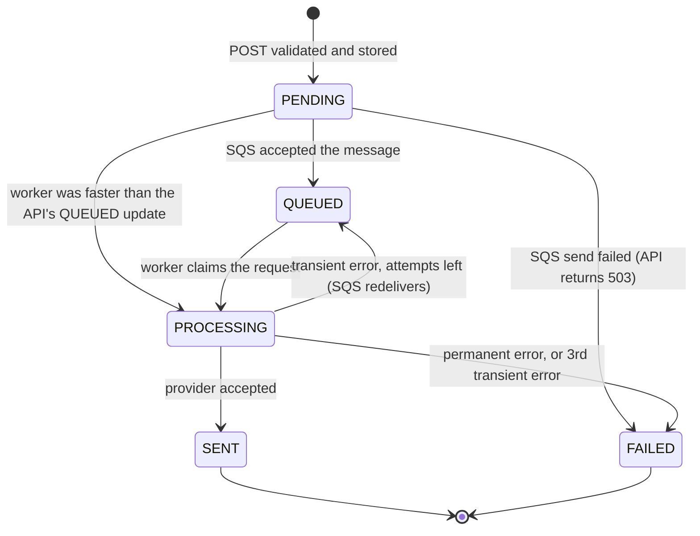

# Notification Request System

A small full-stack **serverless** application. A user submits a notification request from a web form; the
backend validates and stores it, hands it to SQS, and a worker processes it asynchronously while the UI shows
every request's status live.

Delivery itself is **simulated** — the point of the project is the request lifecycle (validation, storage,
queueing, retries, status), not a vendor integration.

| Live                                                                    |                                   |
| ----------------------------------------------------------------------- | --------------------------------- |
| **App** — <https://noti-request-system.vercel.app>                      | Vercel, static Next.js export     |
| **API** — `https://jvw8398zx2.execute-api.ap-southeast-2.amazonaws.com` | AWS `ap-southeast-2`, stage `dev` |
| **Source** — <https://github.com/sumiyab/noti-request-system>           | `main` is what is deployed        |

## Contents

- [What it does](#what-it-does)
- [Tech stack](#tech-stack)
- [Architecture](#architecture)
- [Notification lifecycle](#notification-lifecycle)
- [API](#api)
- [Decisions I made](#decisions-i-made)
- [Project structure](#project-structure)
- [Run it](#run-it)
- [Testing](#testing)
- [Trade-offs and known limitations](#trade-offs-and-known-limitations)
- [Future improvements](#future-improvements)
- [Further reading](#further-reading)

## What it does

The brief asked for seven behaviours. Each one, and where it is met:

1. **Submit a request from the frontend** — the form sends `POST /notifications` (email, SMS or push, on
   behalf of a user).
2. **Backend receives and validates** — the same zod schema the form uses; `400` with one message per field.
3. **Valid requests are stored in DynamoDB** — one item per request, conditional `PutItem`.
4. **Requests have a status / lifecycle** — `PENDING → QUEUED → PROCESSING → SENT | FAILED`, every transition
   a guarded DynamoDB update.
5. **Requests go to asynchronous processing via SQS** — a pointer message; an SQS-triggered worker claims,
   sends, records the outcome, retries transient errors, and dead-letters poison messages.
6. **Frontend shows submitted requests and their result** — a live list with status, attempts, last error;
   filter by user.
7. **Clear success / failure feedback** — success toast; server validation errors land on the field; network,
   `503` and `500` become an error toast; the list has its own error state.

## Tech stack

| Required by the brief                                    | Used                                                                                          |
| -------------------------------------------------------- | --------------------------------------------------------------------------------------------- |
| TypeScript, Node.js                                      | TypeScript everywhere; Lambda runtime `nodejs22.x`                                            |
| Serverless Framework, Lambda, API Gateway, DynamoDB, SQS | Serverless v4; 4 Lambdas; HTTP API; one table + 2 GSIs; one queue + DLQ                       |
| React / Next.js / Vite + React, in TypeScript            | Next.js App Router, statically exported; TanStack Query; react-hook-form + zod; shadcn/ui     |
| _(my additions)_                                         | Bun workspaces for tooling; Jest; ESLint + Prettier; a shared `@noti/shared` contract package |

## Architecture

<!-- Source: docs/architecture.mmd. Regenerate with:
     cd docs && bunx --bun @mermaid-js/mermaid-cli -i architecture.mmd -o architecture.svg -p puppeteer.json -c mermaid.config.json -b white
     (and -o architecture.png -s 2 for the PNG) -->


How a request flows through the system:

How a request flows:

1. The frontend validates the form with the **same zod schema the API uses** and sends `POST /notifications`.
2. `createNotification` validates again, stores the request as `PENDING`, sends `{ notificationId }` to SQS,
   marks it `QUEUED`, and responds `202 Accepted`.
3. SQS invokes `processNotifications` in batches. For each message the worker _claims_ the request
   (`PROCESSING`), calls the provider, and records `SENT`, `FAILED`, or `QUEUED` again for a retry.
4. The frontend polls `GET /notifications` (optionally `?userId=`) while any request is in flight.

### Request sequence

The same flow over time, including the failure branches:

<!-- Source: docs/request-sequence.mmd. Regenerate with:
     cd docs && bunx --bun @mermaid-js/mermaid-cli -i request-sequence.mmd -o request-sequence.svg -p puppeteer.json -c mermaid.config.json -b white
     (and -o request-sequence.png -s 2 for the PNG) -->


## Notification lifecycle



| Status       | Meaning                                                                     |
| ------------ | --------------------------------------------------------------------------- |
| `PENDING`    | Stored, not yet confirmed in the queue (normally milliseconds).             |
| `QUEUED`     | In SQS, waiting for a worker — initially or for a retry.                    |
| `PROCESSING` | A worker has claimed it and is calling the provider.                        |
| `SENT`       | **Terminal.** The provider accepted it.                                     |
| `FAILED`     | **Terminal.** Permanent error, retries exhausted, or could not be enqueued. |

Every transition is one DynamoDB `UpdateItem` whose condition names the allowed "from" states, so a duplicate
or late SQS delivery can never move a request backwards. The six transitions live in
`backend/src/domain/lifecycle.ts`; the reasoning is in
[docs/dynamodb-table-design.md](docs/dynamodb-table-design.md#writes-and-conditions).

## API

Base URL: the deployed API above, or `http://localhost:3001` locally. JSON in, JSON out.

| Endpoint                                    | Returns                                                                  |
| ------------------------------------------- | ------------------------------------------------------------------------ |
| `POST /notifications`                       | `202` + `Location` + the stored item; `400`, `413`, `503`                |
| `GET /notifications?limit=&cursor=&userId=` | `200` `{ data, nextCursor }`, newest first; `userId` narrows to one user |
| `GET /notifications/{id}`                   | `200` `{ data }`; `404`; `400` if not a UUID                             |

**Request** — `userId` is who sends it (1–64 chars of `A–Z a–z 0–9 @ . _ | : -`); the rest depends on
`channel`:

```json
{
  "userId": "user-42",
  "channel": "EMAIL",
  "recipient": "jane@example.com",
  "subject": "Welcome!",
  "message": "Thanks for signing up."
}
```

| --------- | -------------------------------------------------- | -------------------------------- |
------------- | | `EMAIL` | valid email address, ≤ 254 chars | required, ≤ 150 chars | ≤ 5,000 chars | | `SMS`
| E.164 phone number, e.g. `+97699112233` | not allowed | ≤ 1,600 chars | | `PUSH` | device token, 8–512 chars
of `A–Z a–z 0–9 : . _ -` | required (the push title), ≤ 100 | ≤ 1,000 chars |

`userId` (every channel) is the identified user the request is sent on behalf of: 1–64 chars of

Strings are trimmed; unknown fields are rejected.

**Response** — `202 Accepted`, `Location: /notifications/{id}`:

```json
{
  "data": {
    "id": "3f0c9a52-8f6e-4d63-9a51-3c1e0f2b7d10",
    "userId": "user-42",
    "channel": "EMAIL",
    "recipient": "jane@example.com",
    "subject": "Welcome!",
    "message": "Thanks for signing up.",
    "status": "QUEUED",
    "attempts": 0,
    "createdAt": "2026-09-11T04:00:00.000Z",
    "updatedAt": "2026-09-11T04:00:00.012Z"
  }
}
```

Once processing has run, a request also carries `completedAt` (terminal states), `providerMessageId` (`SENT`)
or `lastError` (retries and `FAILED`).

Once processed, an item also carries `completedAt`, and `providerMessageId` (`SENT`) or `lastError` (retries
and `FAILED`).

### Errors

Every error uses one envelope:

```json
{
  "error": {
    "code": "VALIDATION_ERROR",
    "message": "Request validation failed",
    "details": [{ "path": "recipient", "message": "Enter a valid email address" }],
    "requestId": "c6af9ac6-7b61-11e6-9a41-93e8deadbeef"
  }
}
```

| HTTP  | `code`              | When                                                                                   |
| ----- | ------------------- | -------------------------------------------------------------------------------------- |
| `400` | `INVALID_JSON`      | The body is not valid JSON                                                             |
| `400` | `VALIDATION_ERROR`  | Body, path, or query parameters failed validation; `details` lists each field          |
| `404` | `NOT_FOUND`         | No request with that id                                                                |
| `413` | `PAYLOAD_TOO_LARGE` | The body is larger than 32 KB                                                          |
| `503` | `ENQUEUE_FAILED`    | Stored but could not be queued; the request is marked `FAILED` and is safe to resubmit |
| `500` | `INTERNAL_ERROR`    | Unexpected error; the message is generic, details go to the logs under `requestId`     |

Full contract and validation rules: [docs/api-contract-and-validation.md](docs/api-contract-and-validation.md)
· endpoint design: [docs/api-endpoint-design.md](docs/api-endpoint-design.md).

## Decisions I made

The brief left these open. One line each; the reasoning and rejected alternatives are in
[docs/design-decisions.md](docs/design-decisions.md).

- **Data structure** —
  `id, userId, channel, recipient, subject?, message, status, attempts, createdAt, updatedAt` +
  `completedAt?, providerMessageId?, lastError?` → [API](#api)
- **API endpoints** — Three: create, list, read. No edit/delete — the system owns `status`. →
  [api-endpoint-design.md](docs/api-endpoint-design.md)
- **Request / response format** — JSON; `{ data }` on success, one error envelope
  `{ error: { code, message, details?, requestId } }` →
  [api-contract-and-validation.md](docs/api-contract-and-validation.md)
- **Validation strategy** — One zod schema in `@noti/shared`, used by the form and re-run by the API; strict
  objects; per-channel rules → [api-contract-and-validation.md](docs/api-contract-and-validation.md)
- **DynamoDB table** — One table, on-demand, PITR, KMS; optional attributes omitted, not null →
  [dynamodb-table-design.md](docs/dynamodb-table-design.md)
- **DynamoDB keys** — PK `id` (UUID); GSI `byCreatedAt` (`entityType`, `createdAt`) for the global list; GSI
  `byUser` (`userId`, `createdAt`) for one user's history →
  [dynamodb-table-design.md](docs/dynamodb-table-design.md)
- **SQS message** — `{ "notificationId": "<uuid>" }` — a pointer; DynamoDB is the source of truth →
  [sqs-message-design.md](docs/sqs-message-design.md)
- **Lambda structure** — Handlers → services → repositories/queue/provider; services never import the AWS SDK
  → [lambda-function-design.md](docs/lambda-function-design.md)
- **One Lambda or many** — One per route + one SQS worker: least-privilege IAM and per-operation metrics →
  [lambda-function-design.md](docs/lambda-function-design.md)
- **Asynchronous flow** — Store `PENDING` → SQS → `QUEUED`; worker claims with a conditional update; SQS
  redelivery is the retry; `attempts < 3` enforced in the condition; DLQ after 5 receives →
  [Request sequence](#request-sequence)
- **Code organisation** — Bun workspace monorepo: `shared/`, `backend/`, `frontend/`; one toolchain →
  [Project structure](#project-structure)
- **What to test** — Schema rules; services with `jest.fn()` mocks; repositories with `aws-sdk-client-mock`;
  the real pipeline on DynamoDB Local + ElasticMQ; UI with Testing Library → [Testing](#testing)

## Project structure

```
.
├── package.json            Bun workspaces + root scripts
├── eslint.config.mjs       shared lint rules (160-line files, arrow functions, no unused code)
├── .prettierrc             formatting
├── docker-compose.yml      DynamoDB Local + ElasticMQ (SQS-compatible) for local development
├── docs/                   architecture diagram; backend, DynamoDB, SQS, Lambda, API and frontend design docs
├── shared/                 @noti/shared — the API contract, used by both sides
│   ├── src/                zod schemas, types, constants
│   └── specs/
├── backend/                Serverless service (Lambda runs Node.js 22) — see docs/backend-design.md
│   ├── serverless.yml      functions, events, per-function IAM, DynamoDB + SQS resources
│   ├── jest.config.mjs     unit tests (@swc/jest); jest.integration.config.mjs for the emulator suite
│   ├── src/
│   │   ├── handlers/       one folder per Lambda (http/*, queue/*), each exporting from index.ts; parse input, map output
│   │   ├── services/       business logic (create, list, get, process) — no AWS SDK imports
│   │   ├── domain/         lifecycle transition rules
│   │   ├── repositories/   DynamoDB access: keys, condition expressions, pagination cursors
│   │   ├── queue/          SQS producer and message schema
│   │   ├── providers/      NotificationProvider interface + simulated implementation
│   │   └── lib/            config, errors, HTTP helpers, logger
│   ├── local/              local runner (HTTP server + SQS poller), table bootstrap, elasticmq.conf
│   └── specs/              helpers/ (jest.fn() mocks, event builders), unit/, integration/
└── frontend/               Next.js App Router app, statically exported
    ├── jest.config.mjs     next/jest + jsdom + Testing Library
    ├── src/app/            layout, page, providers
    ├── src/components/     notification-form/, notification-list/, ui/ (shadcn)
    ├── src/hooks/          TanStack Query hooks (list polling, create mutation)
    ├── src/lib/            typed API client, query keys, formatting helpers
    └── specs/              Jest: lib/, hooks/, components/
```

## Run it

Needs **Bun 1.3+**, **Node 22**, and **Docker** (for the local emulators only).

```bash
bun install
cp backend/.env.example backend/.env.local && cp frontend/.env.example frontend/.env.local
docker compose up -d       # DynamoDB Local (:8000) + ElasticMQ (:9324)
bun run dev:backend        # API + worker on http://localhost:3001 — the real Lambda handlers, no AWS
bun run dev:frontend       # app on http://localhost:3000
```

> Port taken? `DYNAMODB_PORT=8001 docker compose up -d` and set
> `AWS_ENDPOINT_URL_DYNAMODB=http://localhost:8001` in `backend/.env.local`.

| Command                                 | What it does                                        |
| --------------------------------------- | --------------------------------------------------- |
| `bun run test`                          | Jest unit specs in every workspace                  |
| `bun run test:integration`              | Backend specs against DynamoDB Local + ElasticMQ    |
| `bun run typecheck` / `lint` / `format` | `tsc --noEmit` / ESLint / Prettier, every workspace |

To see every branch of the lifecycle: a recipient containing **`fail`** → permanent error → `FAILED`;
`SIMULATED_FAILURE_RATE` (default `0.2`) → random transient errors → retry, `FAILED` after 3 attempts.

**Deploy:** `cd backend && bunx serverless deploy --stage dev` for AWS, `vercel deploy --prod` from the repo
root for the frontend. Details, what is live, alarms and scale limits:
[docs/operations.md](docs/operations.md).

## Testing

Three levels, all fast enough to run on every change:

- **Unit** (`bun run test`) — `shared/specs`: every validation rule. `backend/specs/unit`: lifecycle rules,
  services with `jest.fn()` mocks asserting the exact calls, handlers, repositories with
  `aws-sdk-client-mock`. `frontend/specs`: form, channel switching, list, filter, polling, API client —
  `fetch` mocked.
- **Integration** (`bun run test:integration`) — the real handlers against DynamoDB Local + ElasticMQ: create
  → queued → processed, pagination, conditional-update conflicts, partial batch failures.
- **Manual end-to-end** — the local runner + browser, or the live deployment.

Not tested on purpose: the CloudFormation (validated by `serverless package` and a real deploy) and
pixel-level UI.

## Trade-offs and known limitations

Short form; the full reasoning is in
[docs/design-decisions.md](docs/design-decisions.md#trade-offs-and-known-limitations).

- **No authentication** — so `userId` is whatever the caller claims, and `?userId=` can read anyone's history.
  First thing to close in production: a JWT authorizer, `userId` from the token.
- **`POST` is not idempotent** — a client retry after a timeout creates two requests. Fix: `Idempotency-Key`.
- **Only the latest status is kept** — no transition history for audit. Fix: an append-only event log.
- **No retention policy** — message bodies stay forever. Fix: TTL attribute + retention rules.
- **A crash between the DynamoDB write and the SQS send leaves a request `PENDING`** — milliseconds wide,
  visible, fixed by a transactional outbox.
- **Fixed 60 s retry delay**, not exponential backoff.
- **`byCreatedAt` has one partition** — fine to ~1 000 writes/s; shard by date beyond that.
- **Polling**, not push — right for hundreds of viewers, wrong for 100k concurrent. Scale numbers:
  [docs/operations.md](docs/operations.md#scale--what-this-stack-handles-today-and-what-gives-first).
- **The provider is simulated** — nothing is delivered.
- **Specs run under Bun, production under Node 22** — same handlers, not identical runtimes.

## Future improvements

In the order I would do them:

1. **Real providers** — SES / SNS / FCM behind the existing `NotificationProvider` interface.
2. **Transactional outbox** — removes the `PENDING` window.
3. **Authentication** — Cognito JWT authorizer; `userId` from the token; list scoped to the caller.
4. **Idempotency key, transition history, retention** — the three fintech-grade gaps above.
5. **Exponential backoff** — `DelaySeconds` from `attempts`.
6. **Operations, next step** — `FAILED`-rate alarm, dashboard, DLQ redrive runbook, customer-managed KMS key.
7. **Live updates** — WebSocket API or SSE from a DynamoDB Stream.
8. **CI** — GitHub Actions: typecheck, lint, unit + integration specs, deploy on merge.
9. **Product features** — templates, scheduled sends, cancel while `QUEUED`.

## Further reading

| Document                                                                   | What it covers                                                                               |
| -------------------------------------------------------------------------- | -------------------------------------------------------------------------------------------- |
| [docs/design-decisions.md](docs/design-decisions.md)                       | Why I chose this; every decision with its rejected alternative; full trade-offs              |
| [docs/operations.md](docs/operations.md)                                   | Deploying to AWS and Vercel; what is live; alarms, guard rails, scale limits                 |
| [docs/api-contract-and-validation.md](docs/api-contract-and-validation.md) | Request/response formats, validation rules, error envelope, the receive → store walk-through |
| [docs/api-endpoint-design.md](docs/api-endpoint-design.md)                 | Resource model, per-endpoint behaviour, what is deliberately not exposed                     |
| [docs/dynamodb-table-design.md](docs/dynamodb-table-design.md)             | Access patterns, keys, both indexes, cursors, conditional writes                             |
| [docs/sqs-message-design.md](docs/sqs-message-design.md)                   | Message shape, batching, retries, DLQ                                                        |
| [docs/lambda-function-design.md](docs/lambda-function-design.md)           | The four functions, layering, handler contracts, IAM, alarms                                 |
| [docs/backend-design.md](docs/backend-design.md)                           | Backend source tree, local runner, testing with Jest                                         |
| [docs/frontend-design.md](docs/frontend-design.md)                         | Components, form, data fetching, styling, lint, tests                                        |
