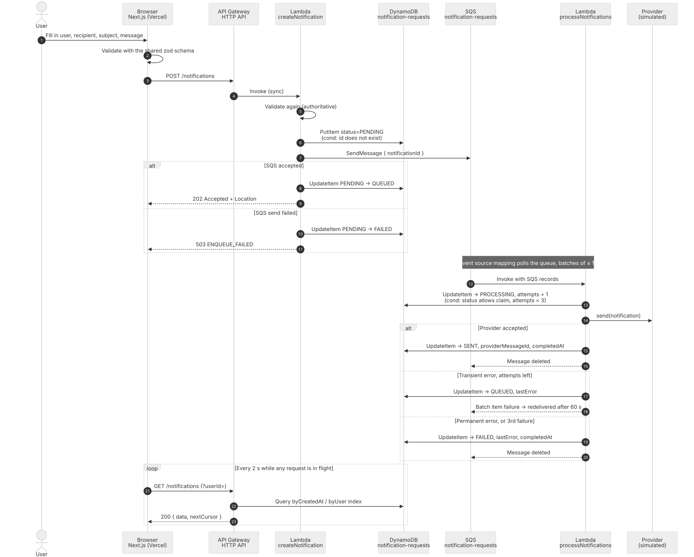
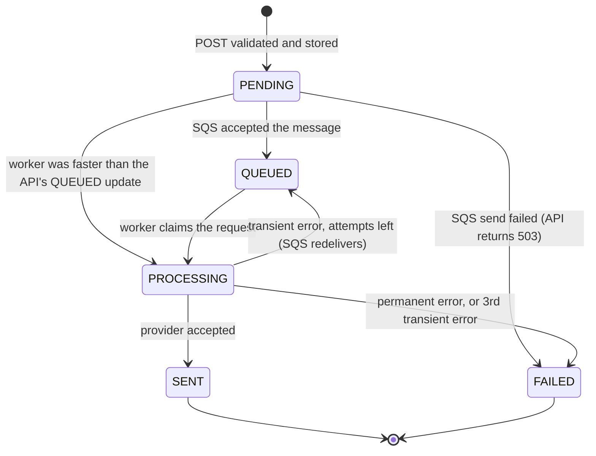
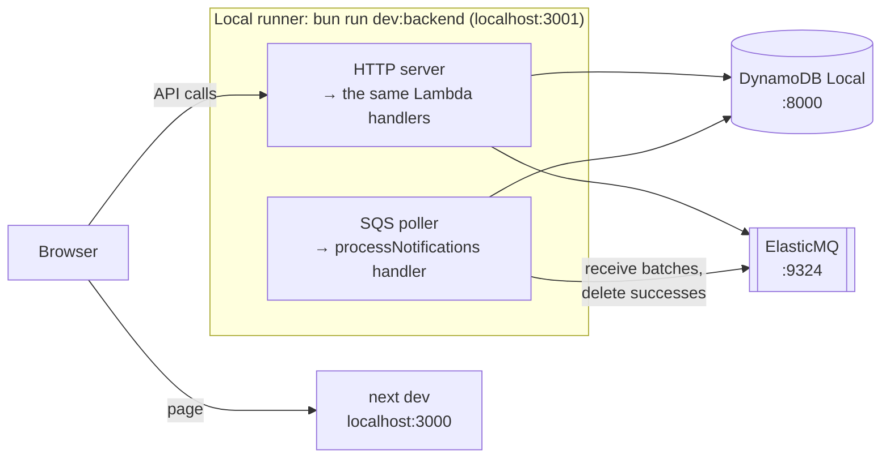
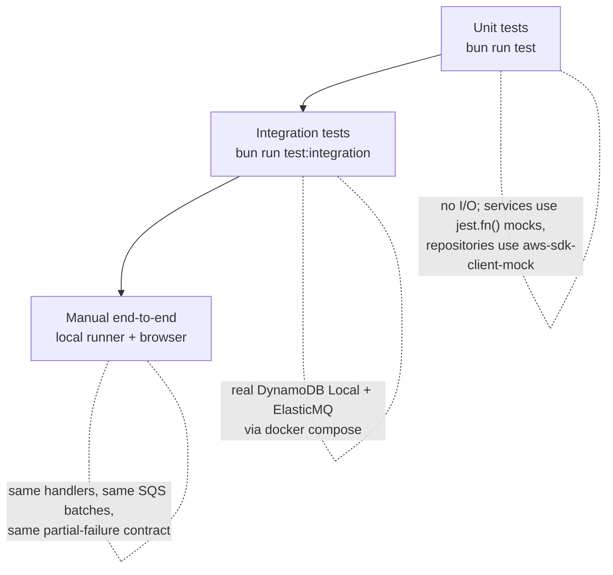

# Notification Request System

A small full-stack **serverless** application for submitting notification requests and tracking them through
an **asynchronous processing pipeline**.

- **Frontend** — Next.js (App Router) + TypeScript, statically exported: submit an email, SMS, or push request
  on behalf of a user, get instant validation feedback, watch its status change live, and filter the list to
  one user.
- **Backend** — TypeScript on AWS Lambda (Node.js 22), deployed with Serverless Framework v4: API Gateway
  (HTTP API) → Lambda → DynamoDB, with SQS driving asynchronous processing.
- **Tooling** — [Bun](https://bun.sh) workspaces for installs, scripts, tests, and the local runner;
  [ESLint](https://eslint.org) + [Prettier](https://prettier.io) for linting and formatting;
  [Jest](https://jestjs.io) for tests in every workspace.

> Actual delivery (email / SMS / push) is performed by a **simulated provider**. The goal of this project is
> the request lifecycle — validation, persistence, queueing, retries, status tracking — not a vendor
> integration. Swapping in SES / SNS is a single-class change (see
> [Future improvements](#future-improvements)).

## Quick start

| Deployment                                                              | Where it runs                                                                            |
| ----------------------------------------------------------------------- | ---------------------------------------------------------------------------------------- |
| **App** — <https://noti-request-system.vercel.app>                      | Vercel (static Next.js export)                                                           |
| **API** — `https://jvw8398zx2.execute-api.ap-southeast-2.amazonaws.com` | AWS `ap-southeast-2`, stack `noti-request-system-dev` — try `GET /notifications?limit=5` |
| **Source** — <https://github.com/sumiyab/noti-request-system>           | `main` is what is deployed; details in [Live deployment](#live-deployment)               |

**Run it locally** (Bun 1.3+, Node 22, Docker):

```bash
bun install
cp backend/.env.example backend/.env.local && cp frontend/.env.example frontend/.env.local
docker compose up -d       # DynamoDB Local + ElasticMQ
bun run dev:backend        # API + worker on http://localhost:3001
bun run dev:frontend       # app on http://localhost:3000
```

**Check it:** `bun run test` (unit, every workspace) · `bun run test:integration` (against the emulators) ·
`bun run typecheck` · `bun run lint`.

**Deploy it:**

```bash
cd backend && bunx serverless deploy --stage dev   # AWS: API Gateway + 4 Lambdas + DynamoDB + SQS
vercel deploy --prod                               # Vercel: from the repo root, Root Directory = frontend
```

Step-by-step versions with prerequisites, ports and environment variables:
[Getting started](#getting-started).

## Contents

- [Quick start](#quick-start)
- [Architecture](#architecture)
- [Notification lifecycle](#notification-lifecycle)
- [Project structure](#project-structure)
- [Getting started](#getting-started)
- [Live deployment](#live-deployment)
- [API reference](#api-reference)
- [Design decisions](#design-decisions)
- [Testing strategy](#testing-strategy)
- [Trade-offs and known limitations](#trade-offs-and-known-limitations)
- [Future improvements](#future-improvements)

## Architecture

<!-- Source: docs/architecture.mmd. Regenerate with:
     cd docs && bunx --bun @mermaid-js/mermaid-cli -i architecture.mmd -o architecture.svg -p puppeteer.json -c mermaid.config.json -b white
     (and -o architecture.png -s 2 for the PNG) -->



How a request flows through the system:

1. The frontend validates the form with the **same zod schema the API uses** and sends `POST /notifications`.
2. `createNotification` validates again (the server never trusts the client), stores the request as `PENDING`,
   sends `{ notificationId }` to SQS, marks the request `QUEUED`, and responds `202 Accepted`.
3. The Lambda SQS event source mapping polls the queue and invokes `processNotifications` with batches. For
   each message the worker _claims_ the request (`PROCESSING`), calls the provider, and records the outcome:
   `SENT`, `FAILED`, or back to `QUEUED` for a retry.
4. The frontend polls `GET /notifications` while any request is still in flight, so statuses update live.
   Typing a user id in the list's filter (or clicking a row's sender) switches the poll to
   `GET /notifications?userId=…`, which the `byUser` index answers with only that user's requests.

### Request sequence

The same flow over time, including the failure branches:

<!-- Source: docs/request-sequence.mmd. Regenerate with:
     cd docs && bunx --bun @mermaid-js/mermaid-cli -i request-sequence.mmd -o request-sequence.svg -p puppeteer.json -c mermaid.config.json -b white
     (and -o request-sequence.png -s 2 for the PNG) -->



## Notification lifecycle



| Status       | Meaning                                                                                                                                                                                                                  |
| ------------ | ------------------------------------------------------------------------------------------------------------------------------------------------------------------------------------------------------------------------ |
| `PENDING`    | Stored, not yet confirmed in the queue. Normally lasts milliseconds; a request that _stays_ `PENDING` means the API crashed between the DB write and the SQS send (see [trade-offs](#trade-offs-and-known-limitations)). |
| `QUEUED`     | The message is in SQS, waiting for a worker — initially, or waiting for a retry.                                                                                                                                         |
| `PROCESSING` | A worker has claimed the request and is calling the provider.                                                                                                                                                            |
| `SENT`       | **Terminal.** The provider accepted the notification.                                                                                                                                                                    |
| `FAILED`     | **Terminal.** Permanent error, retries exhausted, or the request could not be enqueued. `lastError` says why.                                                                                                            |

Every transition is a single DynamoDB `UpdateItem` whose `ConditionExpression` requires the current status to
be one of the allowed "from" states. Duplicate or out-of-order events therefore can never move a request
backwards — a duplicate SQS message cannot turn `SENT` back into `PROCESSING`. The rules live in one place in
the code (`backend/src/domain/lifecycle.ts`):

| Transition       | From                              | To           | Performed by                                                             |
| ---------------- | --------------------------------- | ------------ | ------------------------------------------------------------------------ |
| `enqueued`       | `PENDING`                         | `QUEUED`     | API, after SQS accepted the message                                      |
| `enqueueFailed`  | `PENDING`                         | `FAILED`     | API, when the SQS send failed                                            |
| `claimed`        | `PENDING`, `QUEUED`, `PROCESSING` | `PROCESSING` | Worker, before calling the provider (`PROCESSING` = retry after a crash) |
| `sent`           | `PROCESSING`                      | `SENT`       | Worker, provider accepted                                                |
| `retryScheduled` | `PROCESSING`                      | `QUEUED`     | Worker, transient error with attempts left                               |
| `failed`         | `PROCESSING`                      | `FAILED`     | Worker, permanent error or attempts exhausted                            |

## Project structure

```
.
├── package.json            Bun workspaces + root scripts
├── eslint.config.mjs       shared lint rules (160-line files, arrow functions, no unused code)
├── .prettierrc             formatting
├── docker-compose.yml      DynamoDB Local + ElasticMQ (SQS-compatible) for local development
├── docs/                   architecture diagram; backend, DynamoDB, SQS, Lambda, API and frontend design docs
├── shared/                 @noti/shared — the API contract, used by both sides
│   ├── src/                zod schemas, types, constants
│   └── specs/
├── backend/                Serverless service (Lambda runs Node.js 22) — see docs/backend-design.md
│   ├── serverless.yml      functions, events, per-function IAM, DynamoDB + SQS resources
│   ├── jest.config.mjs     unit tests (@swc/jest); jest.integration.config.mjs for the emulator suite
│   ├── src/
│   │   ├── handlers/       one folder per Lambda (http/*, queue/*), each exporting from index.ts; parse input, map output
│   │   ├── services/       business logic (create, list, get, process) — no AWS SDK imports
│   │   ├── domain/         lifecycle transition rules
│   │   ├── repositories/   DynamoDB access: keys, condition expressions, pagination cursors
│   │   ├── queue/          SQS producer and message schema
│   │   ├── providers/      NotificationProvider interface + simulated implementation
│   │   └── lib/            config, errors, HTTP helpers, logger
│   ├── local/              local runner (HTTP server + SQS poller), table bootstrap, elasticmq.conf
│   └── specs/              helpers/ (jest.fn() mocks, event builders), unit/, integration/
└── frontend/               Next.js App Router app, statically exported
    ├── jest.config.mjs     next/jest + jsdom + Testing Library
    ├── src/app/            layout, page, providers
    ├── src/components/     notification-form/, notification-list/, ui/ (shadcn)
    ├── src/hooks/          TanStack Query hooks (list polling, create mutation)
    ├── src/lib/            typed API client, query keys, formatting helpers
    └── specs/              Jest: lib/, hooks/, components/
```

## Getting started

### Prerequisites

- **Bun 1.3+** — installs, scripts, tests, and the local runner
- **Node.js 22** — the Serverless CLI and Next.js run on Node, and it matches the Lambda `nodejs22.x` runtime
- **Docker** — only for running locally
- **For deployment:** AWS credentials, plus a free Serverless Framework account (v4 requires
  `bunx serverless login` once). Default region is `ap-southeast-2`; override with `--region`.

### Install

```bash
bun install              # from the repo root; installs every workspace
```

### Run locally (no AWS account needed)

```bash
cp backend/.env.example backend/.env.local   # emulator endpoints and dummy AWS credentials
cp frontend/.env.example frontend/.env.local # NEXT_PUBLIC_API_URL=http://localhost:3001
docker compose up -d     # DynamoDB Local on :8000, ElasticMQ (SQS) on :9324 (UI on :9325)
bun run dev:backend      # API on http://localhost:3001 + SQS worker; creates the table on first start
bun run dev:frontend     # app on http://localhost:3000
```

> Port taken? `DYNAMODB_PORT=8001 docker compose up -d` and set
> `AWS_ENDPOINT_URL_DYNAMODB=http://localhost:8001` in `backend/.env.local` (`SQS_PORT` likewise).



The local runner (`backend/local/server.ts`) routes HTTP requests to the real Lambda handlers and long-polls
ElasticMQ, invoking the SQS handler with real `SQSEvent` batches and deleting only the messages that were not
reported in `batchItemFailures` — the same contract Lambda follows. The AWS SDK reaches the emulators purely
through the standard `AWS_ENDPOINT_URL_DYNAMODB` / `AWS_ENDPOINT_URL_SQS` environment variables, so
**production code has no "local mode" branches**. The queues (main + dead-letter) are declared in
`backend/local/elasticmq.conf`.

### Deploy to AWS

```bash
cd backend
bunx serverless login                   # once — Serverless Framework v4 requires an account (free for individuals)
bunx serverless deploy --stage dev            # prints the endpoints; --param="frontendOrigin=https://…" for a custom host
```

Optional: `--param="alarmEmail=you@example.com"` subscribes an address to the alarm topic (SNS sends a
confirmation link). Without it the three alarms still evaluate and show in the CloudWatch console.

Point the frontend at the deployed API:

```bash
echo "NEXT_PUBLIC_API_URL=https://<api-id>.execute-api.<region>.amazonaws.com" > frontend/.env.local
bun run dev:frontend                    # or: cd frontend && bun run build → static site in frontend/out
```

`frontend/out` can be hosted on any static host (S3 + CloudFront, Vercel, Netlify). The dev stage allows
`http://localhost:3000` and the deployed frontend (https://noti-request-system.vercel.app) as CORS origins.
Tear the backend down with `bunx serverless remove --stage dev`.

### Deploy the frontend to Vercel

The repo is a Bun workspace, so the Vercel project is linked at the **repo root** with **Root Directory =
`frontend`**; that way `@noti/shared` (a `workspace:*` link) resolves during the build.

```bash
vercel link                                                   # once, at the repo root → creates .vercel/ (gitignored)
vercel env add NEXT_PUBLIC_API_URL production                  # paste the HttpApiUrl from `serverless deploy`
vercel deploy --prod                                           # builds `next build` (static export) and promotes it
```

Vercel detects Next.js and Bun from `bun.lock`. `NEXT_PUBLIC_API_URL` is inlined at build time
(`next.config.ts`), so changing it needs a redeploy. If the frontend moves to another host, redeploy the
backend with `--param="frontendOrigin=https://<new-host>"` so API Gateway's CORS allow-list follows it.

### Useful scripts (repo root)

| Command                    | What it does                                                 |
| -------------------------- | ------------------------------------------------------------ |
| `bun run dev:backend`      | Local API + worker against the Docker emulators              |
| `bun run dev:frontend`     | Next.js dev server                                           |
| `bun run test`             | Jest unit tests in every workspace                           |
| `bun run test:integration` | Backend integration tests against DynamoDB Local + ElasticMQ |
| `bun run typecheck`        | `tsc --noEmit` in every workspace                            |
| `bun run lint` / `format`  | ESLint (`--fix` via `lint:fix`) / Prettier                   |

> Use `bun run test`, not bare `bun test`: the suites are Jest files and run through each workspace's `test`
> script (Bun runs the `jest` binary on Node, so results match CI).

### Exercising the async paths

The simulated provider makes every branch of the lifecycle easy to trigger:

- A recipient containing **`fail`** (e.g. `fail@example.com`) → permanent error → `FAILED` after one attempt.
- `SIMULATED_FAILURE_RATE` (default `0.2`) → random transient errors → the request goes back to `QUEUED`,
  `attempts` increases, SQS redelivers it; after 3 attempts it becomes `FAILED`.

## Live deployment

What is currently running, and where:

- **Frontend** — Vercel project `noti-request-system` → <https://noti-request-system.vercel.app>. Static
  export of `frontend/`; `NEXT_PUBLIC_API_URL` set in the Production environment. Redeployed with
  `vercel deploy --prod` from the repo root.
- **API** — API Gateway HTTP API `jvw8398zx2` in `ap-southeast-2` →
  `https://jvw8398zx2.execute-api.ap-southeast-2.amazonaws.com`. CORS allow-list: `http://localhost:3000` and
  the Vercel origin. No authorizer — see [Trade-offs](#trade-offs-and-known-limitations).
- **Compute** — 4 Lambdas (`createNotification`, `listNotifications`, `getNotification`,
  `processNotifications`), Node.js 22. CloudFormation stack `noti-request-system-dev`, deployed with
  `serverless deploy --stage dev`. One IAM role per function, scoped to the table/indexes/queue it touches.
- **Data** — DynamoDB `notification-requests-dev` with GSIs `byCreatedAt` and `byUser`. PAY_PER_REQUEST,
  point-in-time recovery on.
- **Queue** — SQS `notification-requests-dev` + `notification-requests-dlq-dev`. Event source mapping →
  `processNotifications`, batch ≤ 10, `ReportBatchItemFailures`; 60 s visibility timeout; DLQ after 5
  receives. `SIMULATED_FAILURE_RATE=0.2` so retries are visible.
- **Logs** — CloudWatch `/aws/lambda/noti-request-system-dev-*`, 14-day retention. Structured JSON lines with
  `requestId` / `notificationId`; `aws logs tail <group> --follow` to watch a request go through.
- **Tracing** — X-Ray active on every function, so one trace follows a request from the API Lambda through SQS
  into the worker.
- **Alarms** — SNS topic `noti-request-system-dev-alarms` with three CloudWatch alarms: DLQ not empty (any
  message, 1 min), worker `Errors ≥ 1` (5 min), API `5xx ≥ 1` (5 min). Deploy with
  `--param="alarmEmail=you@example.com"` to subscribe an address; without it the alarms still fire and show in
  the console.
- **Guard rails** — HTTP API stage throttle 10 req/s sustained, burst 20 (the API is unauthenticated, so this
  is the only thing between it and a loop); worker reserved concurrency 5 (≤ 50 in-flight sends against the
  provider); DynamoDB encrypted with a KMS key so every decrypt is in CloudTrail.

The [request sequence](#request-sequence) diagram above is this exact deployment. Nothing in the frontend
bundle or the Lambda code is environment-specific: the same handlers run against DynamoDB Local + ElasticMQ in
[Run locally](#run-locally-no-aws-account-needed) and against AWS here.

## API reference

Base URL: the `HttpApiUrl` stack output, or `http://localhost:3001` locally. JSON in, JSON out. Design
rationale: [docs/api-endpoint-design.md](docs/api-endpoint-design.md).

### `POST /notifications` — submit a notification request

```json
{
  "userId": "user-42",
  "channel": "EMAIL",
  "recipient": "jane@example.com",
  "subject": "Welcome!",
  "message": "Thanks for signing up."
}
```

| `channel` | `recipient`                                        | `subject`                        | `message`     |
| --------- | -------------------------------------------------- | -------------------------------- | ------------- |
| `EMAIL`   | valid email address, ≤ 254 chars                   | required, ≤ 150 chars            | ≤ 5,000 chars |
| `SMS`     | E.164 phone number, e.g. `+97699112233`            | not allowed                      | ≤ 1,600 chars |
| `PUSH`    | device token, 8–512 chars of `A–Z a–z 0–9 : . _ -` | required (the push title), ≤ 100 | ≤ 1,000 chars |

`userId` (every channel) is the identified user the request is sent on behalf of: 1–64 chars of
`A–Z a–z 0–9 @ . _ | : -`, which covers what identity providers issue (UUIDs, `auth0|…`, emails, usernames).
It is stored on the item, returned on every read, and indexed so a user's own history is one query. It lives
in the body only because the API has no authorizer yet; see [Why `userId`](#why-userid) below.

Strings are trimmed; unknown fields are rejected so typos never pass silently.

**`202 Accepted`** with a `Location: /notifications/{id}` header:

```json
{
  "data": {
    "id": "3f0c9a52-8f6e-4d63-9a51-3c1e0f2b7d10",
    "userId": "user-42",
    "channel": "EMAIL",
    "recipient": "jane@example.com",
    "subject": "Welcome!",
    "message": "Thanks for signing up.",
    "status": "QUEUED",
    "attempts": 0,
    "createdAt": "2026-09-11T04:00:00.000Z",
    "updatedAt": "2026-09-11T04:00:00.012Z"
  }
}
```

Once processing has run, a request also carries `completedAt` (terminal states), `providerMessageId` (`SENT`)
or `lastError` (retries and `FAILED`).

#### How a request is received, validated, and stored

Validation runs before any I/O, so only requests that pass every rule reach DynamoDB; a rejected request
writes nothing.

1. **Receive** — API Gateway HTTP API → `createNotification` Lambda
   (`backend/src/handlers/http/createNotification/`). Accepts `POST /notifications`; API Gateway answers CORS
   preflights, `httpHandler` rejects bodies over 32 KB before parsing. _On failure:_ `413 PAYLOAD_TOO_LARGE`.
2. **Parse** — `parseJsonBody` (`backend/src/lib/http.ts`). Body must be present, valid JSON, and a JSON
   object (not an array or scalar). _On failure:_ `400 INVALID_JSON`.
3. **Validate** — `parseWith(createNotificationSchema)` — schema in `shared/src/schemas.ts`. Zod discriminated
   union on `channel`: `userId` plus the per-channel `recipient`/`subject`/`message` rules in the table above,
   trimming, and `strictObject` so unknown fields are rejected. The same schema validates the form, so the UI
   and API can never disagree. _On failure:_ `400 VALIDATION_ERROR` with `details: [{ path, message }]` — one
   entry per field.
4. **Store** — `createNotification` service → `repo.create`
   (`backend/src/repositories/notificationRepository.ts`). Adds `id` (UUID v4), `status: PENDING`,
   `attempts: 0`, `createdAt`/`updatedAt`; `PutItem` into `notification-requests-{stage}` with
   `attribute_not_exists(id)` so an id can never be overwritten; `userId` is a key of the `byUser` index, so
   the item is immediately queryable per user. Then enqueues a pointer on SQS and marks the item `QUEUED`. _On
   failure:_ `503 ENQUEUE_FAILED` — the item is kept and marked `FAILED`, never lost silently.
5. **Respond** — `httpHandler` envelope. `202 Accepted`, `Location: /notifications/{id}`, and the stored item
   in `data`. _On failure:_ Every error shares the envelope in [Errors](#errors).

Covered by tests at each level: `shared/specs/schemas.spec.ts` (every rule),
`backend/specs/unit/handlers/http.spec.ts` (`202` + `Location`, `400 VALIDATION_ERROR`, `400 INVALID_JSON`,
`503 ENQUEUE_FAILED`), and `backend/specs/integration/createAndProcess.spec.ts` (the item really lands in
DynamoDB Local as `QUEUED`, SMS without a `subject` attribute).

### `GET /notifications?limit=20&cursor=<opaque>&userId=<id>` — list, newest first

`limit` is 1–100 (default 20). `cursor` is the `nextCursor` from the previous page; it is opaque to clients.
`userId` is optional: with it, only that user's requests are returned (served by the `byUser` index, so it is
a `Query`, not a filtered scan). A cursor belongs to the query that produced it — reusing one across `userId`
values is a `400`.

```json
{
  "data": [{ "id": "…", "status": "SENT", "…": "…" }],
  "nextCursor": "eyJpZCI6Ij…"
}
```

`nextCursor` is `null` on the last page.

### `GET /notifications/{id}` — fetch one

`200` with `{ "data": { … } }`, `400` if the id is not a UUID, or `404`.

### Errors

Every error uses one envelope:

```json
{
  "error": {
    "code": "VALIDATION_ERROR",
    "message": "Request validation failed",
    "details": [{ "path": "recipient", "message": "Enter a valid email address" }],
    "requestId": "c6af9ac6-7b61-11e6-9a41-93e8deadbeef"
  }
}
```

| HTTP  | `code`              | When                                                                                   |
| ----- | ------------------- | -------------------------------------------------------------------------------------- |
| `400` | `INVALID_JSON`      | The body is not valid JSON                                                             |
| `400` | `VALIDATION_ERROR`  | Body, path, or query parameters failed validation; `details` lists each field          |
| `404` | `NOT_FOUND`         | No request with that id                                                                |
| `413` | `PAYLOAD_TOO_LARGE` | The body is larger than 32 KB                                                          |
| `503` | `ENQUEUE_FAILED`    | Stored but could not be queued; the request is marked `FAILED` and is safe to resubmit |
| `500` | `INTERNAL_ERROR`    | Unexpected error; the message is generic, details go to the logs under `requestId`     |

## Design decisions

### Why I chose this — the short version

The brief fixed the platform: TypeScript on Node.js, Serverless Framework, Lambda, API Gateway, DynamoDB, SQS,
and a React/Next.js frontend, judged on being _clean, correct, maintainable, and not over-engineered_. So the
decisions that were mine are about **how** to use those pieces, and every one of them was made against three
questions: does it keep the system correct under real failure modes, can a reviewer run and read it in
minutes, and can I defend it in one sentence.

**Correctness first, in the database.** The hard part of a notification pipeline is not sending; it is what
happens when SQS delivers a message twice, a worker crashes mid-send, or two workers race. I put the answer in
one place: every status change is a DynamoDB `UpdateItem` whose `ConditionExpression` names the states it may
start from (`domain/lifecycle.ts`). A duplicate or late message simply fails the condition. That single rule
means I did not need FIFO queues, locks, or exactly-once anything — at-least-once delivery becomes harmless.

**Let SQS be the retry engine.** Instead of building a scheduler, a transient failure returns the item to
`QUEUED` and reports the batch item as failed; SQS redelivers after the 60 s visibility timeout. The attempt
cap (`attempts < 3`) lives on the item, enforced by the same conditional update, so it holds even if SQS
redelivers more often than expected. The dead-letter queue is a separate safety net for messages that crash
the worker before it can record anything.

**One schema, two sides.** The most common bug in a form-plus-API app is the two disagreeing about what is
valid. `@noti/shared` holds the zod schemas; the form uses them as its resolver and the API re-validates with
the same objects. A rule change is one commit that cannot leave the UI and backend out of step. This is the
reason the repo is a Bun workspace monorepo rather than two repos.

**Thin handlers, testable services.** Handlers parse the event and shape the response; services hold the rules
and receive `repo`, `queue`, `provider`, `now`, `newId` through a factory. Services never import the AWS SDK,
so their specs are plain `jest.fn()` mocks asserting _which_ call happens _when_ (write before enqueue;
`retryScheduled` vs `failed`). The AWS-facing code is covered once, against DynamoDB Local and ElasticMQ, by
the same handlers that run in Lambda — there is no local-mode branch in production code.

**Record who sent it.** A notification is always sent on behalf of someone; without that the table is a log,
not a record. `userId` is required, stored, returned, and indexed (`byUser`) so a user's history is one
`Query`. It comes from the body only because the API has no authorizer; the one production change is to read
it from the JWT instead — nothing below the handler moves.

**Simulate delivery, not the lifecycle.** The provider is a one-class seam (`NotificationProvider`) with a
simulator that raises both permanent and transient errors, so every branch of the state machine is exercised
end to end. Wiring SES/SNS/FCM would add account setup to the reviewer's path and prove nothing about the
pipeline.

**Polling, static export, Vercel.** The UI has no server-side data, so Next.js exports plain files that can
sit on any static host; TanStack Query turns "poll every 2 s while anything is in flight" into one option.
Requests move through the pipeline in seconds, so WebSockets would be a second API for no visible gain.

**Bun for the toolchain, Node for the runtime.** Bun gives one fast tool for installs, scripts, tests and the
local runner; Lambda stays on `nodejs22.x` as the brief requires, and `jest`, `tsc` and `serverless` all
execute on Node, so nothing Bun-specific ships.

**Operable from day one.** A notification system fails quietly — a message lands in the DLQ and nobody knows.
So the stack ships with the minimum that makes failure visible and bounded, declared next to the queue and
table so no stage can exist without it: three CloudWatch alarms (DLQ not empty, worker errors, API 5xx) on an
SNS topic, X-Ray on every function, a throttle on the open API, a concurrency cap on the worker so a burst
waits in SQS instead of tripping the provider, and KMS on the table so every read of a message body is in
CloudTrail. Each is a few lines of CloudFormation; none changes application code.

**What I deliberately left out** — authentication (and with it the per-user access check), an idempotency key
on `POST`, transition history, a retention policy, exponential backoff, a transactional outbox for the
millisecond `PENDING` window, real providers, WebSockets, CI. Each is listed under
[Trade-offs](#trade-offs-and-known-limitations) or [Future improvements](#future-improvements) with the shape
it would take; none is needed to demonstrate a correct, maintainable pipeline, and adding them would have been
the over-engineering the brief warned against.

### The full list

Each choice below is the simplest option that keeps the system correct; the alternative that was rejected is
noted so the reasoning can be checked.

### Backend

- **One Lambda per route** (`createNotification`, `listNotifications`, `getNotification`) plus one SQS worker
  — Each function gets the minimum IAM policy it needs (the read handlers cannot write, the API cannot touch
  the queue except `SendMessage`), and CloudWatch metrics/logs are per operation. _Instead of:_ A single
  "router" Lambda: fewer resources, but one over-broad IAM policy and cold starts that pay for code the route
  does not use.
- **API Gateway HTTP API** rather than REST API — It is cheaper, has lower latency, and supports the CORS and
  JSON-payload features this project needs. _Instead of:_ REST API: only worth it for request validators,
  usage plans, or API keys — none required here.
- **Handlers → services → repositories/queue/providers** layering (full design:
  [docs/lambda-function-design.md](docs/lambda-function-design.md)) — Handlers only parse input and map
  output; services hold the business rules and receive their dependencies through a factory, so they are
  unit-testable with `jest.fn()` mocks and never import the AWS SDK. _Instead of:_ Everything in the handler:
  shorter, but the lifecycle rules would be untestable without AWS mocks.
- **`@noti/shared` workspace** holding the zod schemas, DTO types, and constants — The frontend and backend
  validate with the _same_ schema, so the two can never drift; TypeScript types are inferred from the schemas
  instead of duplicated. _Instead of:_ Copying the types into each app, or generating them from OpenAPI — more
  machinery for a three-endpoint API.
- **Validate on both sides** (full design:
  [docs/api-contract-and-validation.md](docs/api-contract-and-validation.md)) — Client-side validation gives
  instant feedback; the server re-validates because it must never trust the client. Unknown fields are
  rejected (`strict`) so a typo like `reciepient` fails loudly instead of silently dropping data. _Instead
  of:_ Server-only validation: correct but a worse form experience.
- **`202 Accepted`** for `POST /notifications` — The request is _accepted for processing_, not delivered; the
  status field and `Location` header tell the client where to look. _Instead of:_ `201 Created` would imply
  the notification exists in its final state.
- **Status transitions as DynamoDB conditional updates** (`domain/lifecycle.ts`) — The allowed "from" states
  are encoded in the `ConditionExpression`, so a duplicate or late SQS delivery cannot move a request
  backwards — correctness does not depend on the worker being invoked exactly once. _Instead of:_
  Read-then-write in application code: racy under concurrent deliveries. DynamoDB transactions: unnecessary
  for a single-item update.
- **SQS Standard queue + `ReportBatchItemFailures`** (full design:
  [docs/sqs-message-design.md](docs/sqs-message-design.md)) — The worker only fails the messages that actually
  failed; successful items in the same batch are deleted, not reprocessed. At-least-once delivery is fine
  because every transition is idempotent. _Instead of:_ FIFO queue: exactly-once semantics are not needed and
  it caps throughput at 300 msg/s per group.
- **Retry via SQS redelivery, capped by an `attempts` counter** (3 attempts, 60 s visibility timeout) — The
  retry loop reuses SQS instead of a custom scheduler, and the counter lives on the item so the limit holds
  even if a message is redelivered more than expected. _Instead of:_ Step Functions for retries: more moving
  parts than a three-attempt policy warrants.
- **Dead-letter queue after 5 receives** — Catches "poison" messages that crash the worker before it can
  record a status — a separate safety net from the business-level retry limit. _Instead of:_ No DLQ: a
  crashing message would circle forever.
- **Alarms in the stack** (DLQ not empty, worker `Errors`, API `5xx` → one SNS topic) — The three signals that
  mean "a human has to look", declared in `serverless.yml` so every stage has them; an email is subscribed
  with `--param="alarmEmail=…"`. Business failures (`FAILED` items) are deliberately not alarmed — they are
  expected and recorded on the item. _Instead of:_ Alarms created by hand in the console: they drift, and a
  fresh stage has none.
- **X-Ray on every function** — One trace follows a request from the API Lambda through SQS into the worker,
  which is how a single stuck request gets debugged. _Instead of:_ Correlating by `requestId` across three log
  groups by hand.
- **Throttle on the HTTP API stage** (10 req/s, burst 20) — The API has no authorizer, so this is the only
  bound on what one loop can cost in Lambda invocations and provider sends. _Instead of:_ WAF rate rules:
  finer, but a second service for a demo; per-client limits need an authorizer first.
- **Reserved concurrency 5 on the worker** — At most 50 in-flight provider sends; a burst waits in SQS rather
  than hitting SES/SNS rate limits and burning attempts on transient errors. _Instead of:_ Default scaling to
  1,000: fine for the simulator, a self-inflicted outage against a real provider.
- **KMS encryption on the table** — Message bodies are PII; with a KMS key every decrypt is a CloudTrail
  event. AWS-managed key for now; a customer-managed key is one more property once the business owns key
  policy. _Instead of:_ The default AWS-owned key: encrypted, but no audit trail per access.
- **`byCreatedAt` GSI for listing** (full design:
  [docs/dynamodb-table-design.md](docs/dynamodb-table-design.md)) — The list endpoint queries the index with a
  constant partition key sorted by `createdAt`, giving "newest first" without a table scan. Pagination uses
  the query's `LastEvaluatedKey`, base64-encoded as an **opaque cursor** so clients cannot depend on its
  shape. _Instead of:_ `Scan` + client-side sorting: fine at ten items, unusable at ten thousand. Offset
  pagination: DynamoDB does not support it.
- **`userId` on every item, with a `byUser` GSI** (`userId` + `createdAt`) — In a real product the sender is
  an identified user, and "my requests" is the query that matters. Storing the id makes every item
  attributable, and the index turns the per-user list into one `Query` on a naturally well-distributed key —
  no hot partition, no `FilterExpression`. _Instead of:_ `FilterExpression` on `byCreatedAt`: reads every item
  and returns ragged pages. Making `userId` the table's partition key: the worker only knows the `id` from
  SQS.
- **`NotificationProvider` interface with a simulated implementation** — The lifecycle is the point of the
  exercise; the provider boundary is where SES / SNS / FCM would plug in. The simulator distinguishes
  _permanent_ from _transient_ errors so both retry branches are exercised. _Instead of:_ Real SES/SNS: adds
  account setup and sandbox restrictions to the reviewer's path with no gain for the lifecycle logic.
- **CORS configured once on the HTTP API** (`provider.httpApi.cors`), restricted to the frontend origin; the
  local runner mirrors the same headers — API Gateway answers preflights without invoking a Lambda and adds
  the headers to every response, including errors — so handlers contain no CORS code in any environment.
  _Instead of:_ Setting headers in each handler: duplicated, and API Gateway ignores them anyway once `cors`
  is configured. `allowedOrigins: ['*']`: simpler but open to any site.
- **Configuration via environment variables**, read once in `lib/config.ts` — Table name, queue URL, retry
  limits, and failure rate are injected by `serverless.yml`; local runs point the AWS SDK at the emulators
  with the standard `AWS_ENDPOINT_URL_*` variables, so **there is no local-mode branch in production code**.
  _Instead of:_ A config file per stage: another thing to keep in sync with the CloudFormation outputs.
- **32 KB request body limit** — The largest valid request (a 5,000-character email) fits with room to spare;
  anything bigger is rejected before parsing to keep memory and log volume bounded. _Instead of:_ Relying on
  API Gateway's 10 MB limit alone.

#### How DynamoDB is used

One table, keyed by `id`, plus two global secondary indexes. The keys _are_ the data model: the table's
partition key is a UUID so writes spread across partitions, and each index re-partitions the same items for
one list shape (full design: [docs/dynamodb-table-design.md](docs/dynamodb-table-design.md)).

| Structure             | Partition key                 | Sort key    | Answers                                                         |
| --------------------- | ----------------------------- | ----------- | --------------------------------------------------------------- |
| **Table**             | `id` (UUID v4)                | —           | `GetItem` by id; `PutItem` on create; every status transition   |
| **GSI `byCreatedAt`** | `entityType` = `NOTIFICATION` | `createdAt` | `GET /notifications` — every request, newest first              |
| **GSI `byUser`**      | `userId`                      | `createdAt` | `GET /notifications?userId=` — one user's history, newest first |

The API leans on these DynamoDB features specifically:

- **Conditional writes** (`ConditionExpression`) — `attribute_not_exists(id)` on create, and
  `#status IN (:from…)` on every transition, so a duplicate or late SQS delivery fails the condition instead
  of moving a request backwards. This is the whole correctness story; no locks or transactions needed.
- **Atomic counter in the same write** — the claim does `ADD attempts :one` under the condition
  `attempts < :max`, so counting and capping attempts is one atomic operation enforced by the database.
- **`ReturnValues: ALL_NEW` and `ReturnValuesOnConditionCheckFailure: ALL_OLD`** — a successful transition
  returns the new item and a refused one returns the current item, so the service can tell _conflict_ from
  _not found_ without a second read.
- **`Query` on the indexes, never `Scan` or `FilterExpression`** — both list shapes are a single `Query` with
  `ScanIndexForward: false`; `ALL` projection means the list never goes back to the table.
- **Cursor pagination** — `Limit + 1` and `ExclusiveStartKey`, with the key base64url-encoded as an opaque
  `nextCursor`, so pages stay stable while new items arrive at the top.
- **Strongly consistent `GetItem`** — `GET /notifications/{id}` immediately after `POST` always sees the item.
- **Schemaless, optional attributes omitted** — SMS items have no `subject` attribute; `completedAt`,
  `providerMessageId`, `lastError` exist only once set. Items are validated on read with the shared schema.
- **On-demand capacity, point-in-time recovery, SSE-KMS, `Retain` on prod** — no capacity planning, a recovery
  path, decrypts in CloudTrail, and a stack delete cannot take production data with it.
- **IAM per action** — read Lambdas get `GetItem`/`Query` only; `Query` is scoped to the two index ARNs; only
  the create Lambda and the worker can write.

Not used, on purpose: `TransactWriteItems` (single-item updates never need it), `Scan`, `FilterExpression`,
Streams (the future outbox / history mechanism), TTL (see retention under trade-offs).

#### Why `userId`

A notification is always sent _by someone_ — a product user, a support agent, a scheduled job acting for a
customer. Recording who is the difference between a log of sends and an auditable record: it answers "what did
this user send?", it is what quotas and abuse limits key on, and it is the partition key the per-user history
view needs. The field is required, not optional, for the same reason `recipient` is: a request with no sender
is not a complete request.

Today the client supplies it, because the API has no authorizer. That is the one part that changes in
production: with a Cognito JWT authorizer on the HTTP API, `createNotification` reads
`requestContext.authorizer.jwt.claims.sub`, the list endpoint scopes itself to the caller, and `userId`
disappears from the body and the query string. Nothing below the handler changes — the schema, item, index,
cursor, and repository are already keyed on it. The frontend's **User ID** field is the demo's stand-in for
that signed-in identity, which is why it survives a successful submit while the message fields clear.

### Frontend

- **Next.js App Router, statically exported** — The UI has no server-side data needs, so `output: 'export'`
  produces plain files that can sit on S3/CloudFront next to the API. Next.js still gives routing, TypeScript,
  and the React tooling the task asks for. _Instead of:_ Vite + React: equally valid; Next.js was chosen for
  familiarity and the deployment story.
- **TanStack Query** for data fetching — Polling, cache invalidation after a mutation, loading/error states,
  and retries come for free; the "poll every 2 s while anything is in flight" rule is a one-line
  `refetchInterval`. _Instead of:_ Hand-written `useEffect` + `setInterval`: more code, more bugs.
- **Polling instead of WebSockets / SSE** — Requests move through the pipeline in seconds; a 2 s poll that
  stops once every request is terminal is simple and cheap. See [Future improvements](#future-improvements).
  _Instead of:_ API Gateway WebSocket API: a second API, connection tables, and push logic for a marginal UX
  gain.
- **Typed API client** (`lib/api.ts`) that turns the error envelope into an `ApiError` — Components deal with
  one error type; validation `details` are mapped back onto form fields. _Instead of:_ Raw `fetch` in
  components.
- **Server-side user filter, validated client-side** — The list's "Filter by user ID" field is debounced (300
  ms) and checked with the shared `userIdSchema` before anything is sent, so an invalid id shows the API's own
  message inline and never costs a request; a valid one becomes `?userId=` and a separate query-key entry, so
  switching users never shows another user's cached page and polling keeps working per filter. A row's sender
  is clickable for the same reason people filter: "show me the rest of this user's history". _Instead of:_
  Filtering the loaded pages in the browser: only sees what is already fetched, and breaks the cursor.
- **One form for three channels, driven by a radio group** — Email / SMS / Push are three fixed,
  always-visible options, so a `RadioGroup` beats a `Select` (nothing hidden, no pointer-event shims in
  tests). The other fields read the chosen channel and adapt: recipient label, input type and hint; subject
  present (email), renamed to title (push), or unmounted (SMS) so the strict SMS schema receives no `subject`
  key. The chosen channel and user id survive a successful submit; only the message-specific fields clear.
  _Instead of:_ One form per channel: three copies of the same submit/error logic. A fixed single channel:
  simpler, but hides two thirds of the API the list already renders.
- **react-hook-form + zod resolver** (full design:
  [docs/frontend-design.md](docs/frontend-design.md#form--react-hook-form--zod)) — The shared schema is the
  resolver, so the form validates with exactly the API's rules; server-side `details[]` map onto fields with
  `setError`. _Instead of:_ `useState` + manual `safeParse`: fewer concepts, but bespoke error plumbing.
- **Tailwind CSS 4 + shadcn/ui** — Utility classes with CSS-first config; shadcn components are copied into
  the repo (accessible Radix primitives, owned as source), so the bundle contains only what is used. _Instead
  of:_ CSS Modules: zero config but every primitive hand-built. MUI/Chakra: runtime theme layer.

### Tooling

- **Monorepo with Bun workspaces** (`shared/`, `backend/`, `frontend/`) — The core idea — one zod schema
  validating both the form and the API — needs `@noti/shared` as a `workspace:*` link, so a rule change
  updates both sides in one commit. One toolchain (ESLint, Prettier, Jest, base tsconfig), one setup command
  for the reviewer, atomic API + UI changes, and `tsc` catches cross-boundary breakage. Each workspace still
  runs, tests, and deploys on its own (`cd backend && bun run test`). _Instead of:_ Separate repos: naturally
  scoped CI and per-repo permissions, which matter with multiple teams — but the shared schema would have to
  be published or copied. Turborepo/Nx: task graph and caching are unnecessary at three packages.
- **Bun** for installs, scripts, and the local runner — One fast tool for the whole monorepo; the local runner
  is a Bun script that runs TypeScript directly with `--watch`. Lambda still runs the **Node.js 22** runtime
  as the task requires, and `jest` / `tsc` / `serverless` execute on Node — Bun never ships to production.
  _Instead of:_ npm + tsx: works, but slower installs and one more tool for the runner.
- **ESLint + Prettier** (full design: [docs/frontend-design.md](docs/frontend-design.md#lint--eslint)) —
  Type-aware rules (`no-floating-promises`), `max-lines: 160`, arrow-functions-only, and unused
  imports/variables/functions as errors — rules Biome cannot express. Prettier owns formatting;
  `eslint-config-prettier` keeps them from overlapping. _Instead of:_ Biome: one fast tool, but no type-aware
  or function-style rules.
- **Jest everywhere** (backend: [docs/backend-design.md](docs/backend-design.md#testing-with-jest); frontend:
  Testing Library) — One runner, one assertion library, one mocking API across the repo. Backend uses
  `@swc/jest` + `aws-sdk-client-mock`; frontend uses `next/jest`, which handles TS, CSS imports, and aliases
  with no extra config. _Instead of:_ `bun test`: faster, but no `jsdom` preset or Next.js transforms, and a
  second runner. Vitest: equally good, not what Next.js documents.
- **Serverless Framework v4** — Required by the task. v4 bundles esbuild, so per-function bundles need no
  extra plugin. _Instead of:_ AWS SAM / CDK.

## Testing strategy

Three levels, each fast enough to run on every change:



- **`shared/specs`** — Every validation rule per channel, trimming, unknown-field rejection, and the exact
  error paths/messages the frontend maps onto fields. _(Jest, table-driven cases.)_
- **`backend/specs/unit`** — Lifecycle rules (every allowed and forbidden transition); services with
  `jest.fn()` mocks of the repository/queue/provider — asserting the exact calls made (write before enqueue,
  `enqueueFailed` on SQS error, `retryScheduled` vs. `failed`, no provider call when the claim is refused);
  handlers — envelope shape, status codes, `Location` header, body-size limit; repositories — the generated
  `UpdateItem`/`Query` inputs and cursor round-trips, using `aws-sdk-client-mock`. _(Jest `*.spec.ts` with
  `jest.fn()` mocks and `aws-sdk-client-mock`, no network.)_
- **`backend/specs/integration`** — The real pipeline against DynamoDB Local + ElasticMQ: create → queued →
  processed → `SENT`/`FAILED`, pagination across pages, conditional-update conflicts, and that only failed
  batch items are redelivered. _(`bun run test:integration` (Jest, `--runInBand`) after `docker compose up`.)_
- **`frontend/specs`** — Form validation and error mapping, channel switching (SMS drops the subject from the
  DOM and the request; the chosen channel and user id survive a submit), success/error toasts, list rendering
  and status badges, polling start/stop, the user filter (typed and via a row, cleared, invalid input blocked
  client-side, filtered empty state), the create hook prepending into exactly the lists that should show the
  new item, the API client's error handling — with the API mocked at the `fetch` boundary. _(Jest + Testing
  Library (`jsdom`), real `QueryClient` per test.)_
- **Manual end-to-end** — Submit from the browser, watch the status change, trigger both failure branches with
  a `fail@…` recipient and `SIMULATED_FAILURE_RATE`. _(`bun run dev:backend` + `bun run dev:frontend`.)_

What is deliberately **not** tested: the CloudFormation in `serverless.yml` (validated by `serverless package`
and a real deploy), and pixel-level UI.

## Trade-offs and known limitations

- **A crash between the DynamoDB write and the SQS send leaves a request stuck in `PENDING`.** The two writes
  are not atomic. The window is milliseconds and the state is visible (not silently lost), which is acceptable
  for this scope; the fix is a transactional outbox — see below.
- **No authentication — and therefore anyone can read anyone's notifications.** The API is open, so `userId`
  is whatever the caller claims, and `GET /notifications?userId=X` returns X's history to any caller. In a
  product this is an IDOR on private communications and would be the first thing to close: a JWT authorizer
  (Cognito) makes `userId` come from the token, and the list endpoint scopes itself to the caller (see
  [Why `userId`](#why-userid)). The stage throttle (10 req/s) limits abuse volume, not access.
- **`POST /notifications` is not idempotent.** A client that times out and retries creates two requests, so
  the recipient may get two messages. The standard fix is an `Idempotency-Key` header stored on the item with
  a conditional `PutItem` (and a GSI or the key as part of the id), returning the original `202` on a replay.
  Left out because the form disables its button while pending, but a broker sending OTPs or withdrawal
  confirmations would want it.
- **Only the latest status is kept.** Each transition overwrites `status`/`updatedAt`; there is no record that
  a request was `QUEUED` at 14:01 and `PROCESSING` at 14:02. For an audit requirement ("prove the margin call
  was sent and when") the transition history would go to an append-only log — a DynamoDB Streams consumer
  writing `notification-events`, or a second item type in the same table.
- **No retention policy.** Message bodies are PII and stay in the table forever. A regulated operator has a
  rule both ways — retain communications for N years, then delete — which maps to a TTL attribute
  (`expiresAt`) set on write and DynamoDB's TTL feature, plus PITR/backups for the retention side.
- **No secrets today, so no secrets handling.** The simulated provider needs none. Real provider credentials
  (SES SMTP, SNS, FCM server key) belong in SSM Parameter Store / Secrets Manager, read once at cold start
  with the function's role granting `GetParameter` on that path only — never in `serverless.yml` environment
  blocks, which end up in CloudFormation and the console.
- **Retries use a fixed 60 s delay**, not exponential backoff. Three attempts a minute apart are enough to
  ride out a brief provider blip; longer outages end in `FAILED` and need a manual resubmit.
- **The `byCreatedAt` index uses a single constant partition key.** That makes "newest first" trivial but
  concentrates the index on one partition. DynamoDB handles this comfortably at thousands of writes per
  second; beyond that the key would be sharded by date.
- **Polling costs one `Query` per open browser every 2 s while a request is in flight.** Fine for a small user
  base; not how a high-traffic dashboard would be built. See _Scale_ below for the numbers.
- **Scale — what this stack handles today, and what gives first.** The write path is horizontal (DynamoDB
  on-demand, SQS, Lambda) and every transition is idempotent, so 100k users _over a day_ is comfortable. 100k
  users _at the same moment_ is not, and the limits are known and in this order:
  1. **The API throttle** — 10 req/s, burst 20 on the HTTP API stage. A deliberate guard for an
     unauthenticated demo endpoint, not a capacity figure; it is one line (`ThrottlingRateLimit`) and the
     account default is 10 000 req/s. Under real load, per-client limits belong to WAF or a usage plan behind
     an authorizer.
  2. **Polling** — 100k open browsers polling every 2 s is 50 000 `Query`/s. This is the architectural
     ceiling: the fix is backoff (2 → 5 → 15 s) and per-item polling for one's own in-flight requests short
     term, and push (WebSocket API or SSE fed by a DynamoDB Stream) at scale.
  3. **Lambda concurrency** — an account quota (400 in the dev account) shared by all four functions; the API
     is one invocation per request. Raising it is a quota request to AWS, not a code change; 10 000+ is
     routine. Provisioned concurrency would flatten cold starts at a known peak.
  4. **The `byCreatedAt` index** — one constant partition key caps the global newest-first list at roughly 1
     000 writes/s. Either shard the key by time bucket (`NOTIFICATION#2026-09-13T14`) or, once there is an
     authorizer, drop the global list altogether: users see their own history via `byUser`, whose key is
     naturally spread.
  5. **Worker throughput** — reserved concurrency 5 × batch 10 at ~1 s per send ≈ 50 sends/s, so 100k queued
     requests drain in ~35 minutes. The number is chosen to sit under a provider's rate limit (SES and SNS SMS
     defaults are in the tens to low hundreds per second per account); raise it with the provider's quota —
     the provider, not this stack, is the real ceiling on sends.
  6. **Not a concern** — DynamoDB on-demand (UUID table key spreads writes; tens of thousands of WCU/RCU on
     demand), SQS standard (effectively unlimited), the Lambda code itself (stateless, ~70–100 ms warm).
- **The provider is simulated.** Nothing is delivered. Delivery receipts, bounces, and provider-side
  idempotency are outside the scope.
- **Tests run under Bun, production runs under Node 22.** The code uses only standard Web/Node APIs that both
  runtimes implement, and the integration tests invoke the same handler modules, but the runtimes are not
  identical. A real CI pipeline would run the integration suite on Node as well.
- **Single region, single stage in the examples.** The stack is parameterised by `--stage`; multi-region
  failover and per-environment accounts are not configured.
- **Cursors are opaque but not signed.** A client could craft one; the worst outcome is an empty page, since
  the cursor only positions a query on the caller's own index.

## Future improvements

Roughly in the order they would be worth doing:

1. **Real providers** — `SesEmailProvider`, `SnsSmsProvider`, `FcmPushProvider` implementing
   `NotificationProvider`, selected by channel. The worker and lifecycle do not change.
2. **Transactional outbox** — write the request and an "outbox" record in one `TransactWriteItems`, and let a
   DynamoDB Streams-triggered Lambda do the SQS send. Removes the stuck-`PENDING` window entirely.
3. **Authentication** — Cognito user pool + HTTP API JWT authorizer; `userId` moves from the body to the
   token's `sub` claim and the list endpoint scopes itself to the caller via the existing `byUser` index. This
   closes the IDOR noted above and is the first item for any real deployment.
4. **Idempotency key, transition history, retention** — the three fintech-grade gaps listed under trade-offs,
   each a small, contained change to the item schema and one handler.
5. **Exponential backoff** — set `DelaySeconds` on redelivery based on `attempts` instead of relying on the
   visibility timeout.
6. **Operations, next step** — alarms and X-Ray exist (see [Live deployment](#live-deployment)); still to do:
   an alarm on the `FAILED` rate (a custom metric emitted by the worker), a CloudWatch dashboard, a DLQ
   redrive runbook, and a customer-managed KMS key with a documented key policy.
7. **Live updates** — API Gateway WebSocket API or SSE from a DynamoDB Stream, replacing polling.
8. **CI** — GitHub Actions running typecheck, lint, unit and integration tests (with the Docker emulators as
   services) on every PR, and `serverless deploy` on merge.
9. **Product features** — templates with variables, scheduled sends, per-recipient status history, and
   cancelling a request while it is still `QUEUED` (one more guarded transition).
