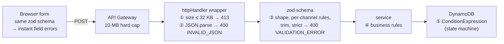

# API contract and validation strategy

The endpoint list and field limits are in the README's [API reference](../README.md#api). This document is the
_rules behind them_: how every request and response is shaped, where each check runs, and why.

## Conventions

| Rule                                                           | Detail                                                                                                                  | Why                                                                                                               |
| -------------------------------------------------------------- | ----------------------------------------------------------------------------------------------------------------------- | ----------------------------------------------------------------------------------------------------------------- |
| JSON only                                                      | Requests and responses are `application/json; charset=utf-8`. Bodies are objects, never bare arrays or scalars.         | One parser, one content type, no negotiation.                                                                     |
| One success envelope                                           | `{ "data": … }` — an object for a single resource, an array for a list, plus sibling metadata (`nextCursor`) for lists. | Metadata never collides with resource fields; clients read `data` the same way everywhere.                        |
| One error envelope                                             | `{ "error": { "code", "message", "details"?, "requestId" } }`                                                           | Same shape for every failure, machine-readable `code`, human `message`, field-level `details` when there are any. |
| `code` is the contract, `message` is not                       | Clients branch on `code` (`VALIDATION_ERROR`); `message` may be reworded freely.                                        | Lets messages improve without breaking callers.                                                                   |
| Ids are UUID v4; timestamps are ISO 8601 UTC with milliseconds | `"3f0c9a52-…"`, `"2026-09-12T04:00:00.000Z"`                                                                            | Opaque, unguessable ids; timestamps that sort as strings and parse in every language.                             |
| Enums are upper-case string literals                           | `EMAIL`, `QUEUED`                                                                                                       | Readable in logs and the console; no lookup table.                                                                |
| Optional fields are absent, not `null`                         | `subject` is missing for SMS; `lastError` is missing until a failure.                                                   | `subject?: string` types stay honest; `null` vs `undefined` never becomes a question.                             |
| Strings are trimmed before validation                          | `"  Welcome! "` → `"Welcome!"`                                                                                          | Whitespace-only input is empty input; trailing spaces never reach the provider.                                   |
| Unknown fields are rejected                                    | `{ …, "reciepient": "x" }` → `400`                                                                                      | A typo fails loudly instead of silently dropping a field.                                                         |
| `requestId` on every error                                     | API Gateway's request id, also in the logs                                                                              | One id to search when a user reports a problem.                                                                   |

### Status codes

| Code  | Used for                                                                  | Not used                                                                                                              |
| ----- | ------------------------------------------------------------------------- | --------------------------------------------------------------------------------------------------------------------- |
| `200` | Reads (`GET`)                                                             | —                                                                                                                     |
| `202` | `POST /notifications` — accepted, not yet delivered                       | `201`: would claim the resource is in its final state                                                                 |
| `400` | Any client input problem: bad JSON, failed validation, bad id, bad cursor | `422`: HTTP API does not distinguish, and two codes for "your input is wrong" is one more thing for clients to handle |
| `404` | Unknown id                                                                | —                                                                                                                     |
| `413` | Body over 32 KB                                                           | —                                                                                                                     |
| `503` | Stored but not enqueued; safe to retry                                    | `500`: this failure is retryable and the client should know that                                                      |
| `500` | Anything unexpected; generic message, details in the logs                 | —                                                                                                                     |

## Request formats

### `POST /notifications`

Headers: `content-type: application/json`. Body: one of three shapes selected by `channel`; every shape
carries `userId`.

```jsonc
// EMAIL
{ "userId": "user-42", "channel": "EMAIL", "recipient": "jane@example.com", "subject": "Welcome!", "message": "…" }
// SMS  — no subject field at all
{ "userId": "user-42", "channel": "SMS",   "recipient": "+97699112233",                            "message": "…" }
// PUSH — subject is the push title
{ "userId": "user-42", "channel": "PUSH",  "recipient": "fcm-token-abc123:def", "subject": "Title", "message": "…" }
```

| Field       | EMAIL                                                   | SMS                         | PUSH                                 |
| ----------- | ------------------------------------------------------- | --------------------------- | ------------------------------------ |
| `userId`    | 1–64 chars of `A–Z a–z 0–9 @ . _ \| : -` (all channels) | same                        | same                                 |
| `recipient` | email address, ≤ 254                                    | E.164 (`^\+[1-9]\d{1,14}$`) | 8–512 chars of `A–Z a–z 0–9 : . _ -` |
| `subject`   | required, 1–150                                         | **must be absent**          | required, 1–100                      |
| `message`   | 1–5,000                                                 | 1–1,600                     | 1–1,000                              |

`userId` is who the request is sent _on behalf of_ — the identified user of the calling product. The charset
covers what identity providers issue (UUIDs, `auth0|…`, emails, usernames). It is a body field only because
this API has no authorizer; with one, the backend takes the id from the token's `sub` claim and the field
leaves the body (see [Evolution](api-endpoint-design.md#evolution)).

### `GET /notifications`

Query: `limit` (integer string, 1–100, default 20) · `cursor` (opaque string from a previous `nextCursor`) ·
`userId` (optional; same rules as the body field — only that user's requests). Unknown query keys are
rejected.

### `GET /notifications/{id}`

Path: `id` must be a UUID; anything else is `400`, not `404` — "that is not even an id" and "no such id" are
different answers.

## Response formats

```jsonc
// 202 — POST                          Location: /notifications/3f0c9a52-…
{ "data": { "id": "3f0c9a52-…", "userId": "user-42", "channel": "EMAIL", "recipient": "jane@example.com", "subject": "Welcome!",
            "message": "…", "status": "QUEUED", "attempts": 0,
            "createdAt": "2026-09-12T04:00:00.000Z", "updatedAt": "2026-09-12T04:00:00.012Z" } }

// 200 — GET /notifications
{ "data": [ { …notification… }, … ], "nextCursor": "eyJpZCI6…" }        // nextCursor is null on the last page

// 200 — GET /notifications/{id}
{ "data": { …notification… } }

// 400 — validation
{ "error": { "code": "VALIDATION_ERROR", "message": "Request validation failed",
             "details": [ { "path": "recipient", "message": "Enter a valid email address" },
                          { "path": "subject",   "message": "Subject is required" } ],
             "requestId": "c6af9ac6-…" } }

// 404
{ "error": { "code": "NOT_FOUND", "message": "Notification 3f0c9a52-… was not found", "requestId": "…" } }
```

The **notification object** is identical in all three success responses — one type, one mapper. Fields that
appear only after processing: `completedAt` (terminal), `providerMessageId` (`SENT`), `lastError` (retry or
`FAILED`).

## Validation strategy

### Where each check runs



| #   | Layer                        | Checks                                                                                                 | Rejects with                                        |
| --- | ---------------------------- | ------------------------------------------------------------------------------------------------------ | --------------------------------------------------- |
| 0   | **Frontend**                 | The same schema as ③, run on submit (and per field on blur). Purely UX; the server never relies on it. | Inline field messages                               |
| 1   | **Handler wrapper** — size   | `Buffer.byteLength(rawBody) ≤ 32 KB`, checked before parsing                                           | `413 PAYLOAD_TOO_LARGE`                             |
| 2   | **Handler wrapper** — syntax | `JSON.parse`; body must be an object                                                                   | `400 INVALID_JSON`                                  |
| 3   | **Schema** — shape and rules | zod `discriminatedUnion` on `channel`; `strictObject` per channel; trim; lengths; formats              | `400 VALIDATION_ERROR` + `details`                  |
| 4   | **Service** — business       | Nothing today beyond ③ (no quotas, no per-recipient rules); the layer exists so those have a home      | `AppError` subclass                                 |
| 5   | **Database** — state         | `ConditionExpression` on `status` / `attempts` for every transition                                    | `TransitionConflict` (handled, never an HTTP error) |

Internal inputs are validated the same way, with the same tool: the **SQS message body**
(`queueMessageSchema`), the **pagination cursor** after base64url-decoding (`cursorSchema` — a bad cursor is
`400` on `cursor`, not a DynamoDB exception), and the **environment** at cold start (`configSchema` — a
missing `TABLE_NAME` fails the first invocation with a clear message rather than a `ResourceNotFoundException`
later).

### Principles

1. **Parse, don't validate.** `createNotificationSchema.parse(body)` returns a _typed, normalised_ value
   (`CreateNotificationInput`) — trimmed, narrowed by channel, unknown keys gone. Downstream code takes that
   type and never re-checks. Types are inferred from the schema (`z.infer`), so there is exactly one
   definition.
2. **Reject unknown, don't strip.** zod's default strips unknown keys silently; `strictObject` makes them an
   error. For an API whose input is a form, a stripped field is a lost field.
3. **Per-channel shapes, not optional fields.** A single object with `subject?: string` would allow an SMS
   with a subject and an email without one. The discriminated union makes each channel's shape exact and gives
   TypeScript the narrowing for free.
4. **Report every problem at once.** `details` lists all failing fields, not the first — one round trip to fix
   a form, and the frontend can highlight every field.
5. **Messages are written once, in the schema.** `'Enter a valid email address'` is the string both the form
   and the API produce. No mapping table, no divergence.
6. **`path` is the field name.** `details[].path` is the dot-joined zod path (`recipient`, `subject`). The
   form maps it to a field; a path it does not recognise becomes a form-level error. Unknown-key errors report
   `path: ""` with the key named in the message.
7. **Limits are also abuse limits.** Field maxima, the 32 KB body cap, `limit ≤ 100` — each bounds memory, log
   volume, and DynamoDB item size (400 KB max; the largest valid item is ~6 KB).
8. **Server-side is authoritative.** Nothing about the frontend's validation is assumed; `curl` sees exactly
   the same rules.

### Schemas

`backend/src/schemas/notification.ts` (moves to a shared workspace when the frontend lands):

```ts
const message = (max: number) =>
  z.string().trim().min(1, 'Message is required').max(max, `Message must be ${max} characters or fewer`);
const subject = (max: number) =>
  z.string().trim().min(1, 'Subject is required').max(max, `Subject must be ${max} characters or fewer`);
const userIdSchema = z
  .string()
  .trim()
  .min(1, 'User ID is required')
  .max(64, 'User ID must be 64 characters or fewer')
  .regex(/^[A-Za-z0-9@._|:-]*$/, 'User ID may only contain letters, digits, and @ . _ | : -');

export const createNotificationSchema = z.discriminatedUnion('channel', [
  z.strictObject({
    userId: userIdSchema,
    channel: z.literal('EMAIL'),
    recipient: z
      .string()
      .trim()
      .max(254, 'Email must be 254 characters or fewer')
      .pipe(z.email('Enter a valid email address')),
    subject: subject(150),
    message: message(5_000),
  }),
  z.strictObject({
    userId: userIdSchema,
    channel: z.literal('SMS'),
    recipient: z
      .string()
      .trim()
      .regex(/^\+[1-9]\d{1,14}$/, 'Enter a phone number in E.164 format, e.g. +97699112233'),
    message: message(1_600),
  }),
  z.strictObject({
    userId: userIdSchema,
    channel: z.literal('PUSH'),
    recipient: z
      .string()
      .trim()
      .min(8)
      .max(512)
      .regex(/^[A-Za-z0-9:._-]+$/, 'Device token may only contain letters, digits, and : . _ -'),
    subject: subject(100),
    message: message(1_000),
  }),
]);

export const notificationIdSchema = z.uuid('id must be a UUID');

export const listNotificationsQuerySchema = z.strictObject({
  limit: z.coerce.number().int().min(1).max(100).default(20),
  cursor: z.string().min(1).optional(),
});
```

`z.coerce.number()` on `limit` because query-string values are always strings. `.pipe(z.email())` after
`.max()` so an absurdly long string fails on length before the format check runs.

### From `ZodError` to `details`

```ts
const details = error.issues.map((i) => ({ path: i.path.join('.'), message: i.message }));
```

Done once in `lib/http.ts`. A `ZodError` thrown anywhere inside a handler becomes `400 VALIDATION_ERROR`; the
handler code itself never builds an error response.

### What is deliberately not validated

- **Reachability** of the recipient (does the mailbox exist, is the number in service) — that is the
  provider's answer, reported through `lastError`.
- **Content** (profanity, spam, links) — out of scope.
- **Duplicates** (same recipient + message twice) — each submission is a distinct request by design.

## Frontend mapping

The client throws `ApiError` for _every_ failure (HTTP errors and network errors alike), and TanStack Query's
`Register` interface types it once for all hooks — no `instanceof` at call sites:

```ts
// lib/api.ts
declare module '@tanstack/react-query' {
  interface Register {
    defaultError: ApiError;
  }
}
```

Field-level errors go through **react-hook-form's `setError`**, so a server rejection renders in the same
`FormMessage` as a client-side one:

```tsx
const form = useForm<CreateNotificationInput>({ resolver: zodResolver(createNotificationSchema) });
const onSubmit = form.handleSubmit((values) =>
  create.mutate(values, {
    onError: (e) => {
      if (e.code !== 'VALIDATION_ERROR') return;
      for (const d of e.details ?? [])
        form.setError(d.path as keyof CreateNotificationInput, { message: d.message });
    },
  }),
);
```

Everything else is handled **once**, in a global `MutationCache`, because it reads the same for any mutation:

```tsx
// app/providers.tsx
new QueryClient({
  mutationCache: new MutationCache({
    onError: (error) => {
      if (error.code === 'VALIDATION_ERROR') return; // rendered inline by the form
      toast.error(
        error.code === 'ENQUEUE_FAILED'
          ? 'Could not queue the request — please try again.'
          : error.code === 'NETWORK_ERROR'
            ? 'Cannot reach the server.'
            : 'Something went wrong.',
      );
    },
  }),
});
```

| Error                                                  | Handled by              | How                                                                     |
| ------------------------------------------------------ | ----------------------- | ----------------------------------------------------------------------- |
| `VALIDATION_ERROR`                                     | the form                | `details[]` → `form.setError(path, { message })`, one message per field |
| `ENQUEUE_FAILED`, `NETWORK_ERROR`, `INTERNAL_ERROR`, … | `MutationCache.onError` | one toast                                                               |
| `GET /notifications` failures                          | the list                | `query.error` → inline "could not load"                                 |

`throwOnError` + an error boundary is deliberately not used: a `400` on a form is expected and recoverable,
and belongs next to the field, not in a boundary.

The form `unregister`s `subject` when `channel === 'SMS'` rather than sending `""`, so the strict schema is
satisfied without a special case.

## Testing

| Suite                 | Cases                                                                                                                                                                                              |
| --------------------- | -------------------------------------------------------------------------------------------------------------------------------------------------------------------------------------------------- |
| Schema (table-driven) | One passing and one failing input per rule in the field table; trim; unknown key; unknown channel; SMS with subject; `limit` coercion, default, bounds; non-UUID id.                               |
| Handler wrapper       | 33 KB body → 413; `{` → `INVALID_JSON`; `[]` body → `INVALID_JSON`; ZodError → 400 with every `details` entry; `AppError` → its status; thrown `Error` → 500 with generic message and `requestId`. |
| Cursor                | round-trip; tampered base64 → 400 on `cursor`.                                                                                                                                                     |
| Config                | missing `TABLE_NAME` → cold-start failure with the variable named.                                                                                                                                 |

## Alternatives considered

| Alternative                                         | Why not                                                                                                                                    |
| --------------------------------------------------- | ------------------------------------------------------------------------------------------------------------------------------------------ |
| API Gateway request validators / JSON Schema models | Only on REST API, not HTTP API; would duplicate the zod rules in a second language and could not express per-channel shapes as clearly.    |
| OpenAPI as the source of truth with generated types | Three endpoints; a zod schema _is_ the executable spec and needs no generator.                                                             |
| `class-validator` + DTO classes                     | Decorators and classes for what is a plain object; weaker TypeScript inference.                                                            |
| RFC 9457 `application/problem+json`                 | A fine standard, but the frontend is the only client and the custom envelope is smaller and carries `details` in the shape the form needs. |
| Strip unknown fields (zod default)                  | Silent data loss on typos; see principle 2.                                                                                                |
| `422 Unprocessable Content` for validation          | Splits "bad input" across two codes with no benefit to this client.                                                                        |

## How a request is received, validated, and stored

Validation runs before any I/O, so only requests that pass every rule reach DynamoDB; a rejected request
writes nothing.

1. **Receive** — API Gateway HTTP API → `createNotification` Lambda
   (`backend/src/handlers/http/createNotification/`). Accepts `POST /notifications`; API Gateway answers CORS
   preflights, `httpHandler` rejects bodies over 32 KB before parsing. _On failure:_ `413 PAYLOAD_TOO_LARGE`.
2. **Parse** — `parseJsonBody` (`backend/src/lib/http.ts`). Body must be present, valid JSON, and a JSON
   object (not an array or scalar). _On failure:_ `400 INVALID_JSON`.
3. **Validate** — `parseWith(createNotificationSchema)` — schema in `shared/src/schemas.ts`. Zod discriminated
   union on `channel`: `userId` plus the per-channel `recipient`/`subject`/`message` rules in the table above,
   trimming, and `strictObject` so unknown fields are rejected. The same schema validates the form, so the UI
   and API can never disagree. _On failure:_ `400 VALIDATION_ERROR` with `details: [{ path, message }]` — one
   entry per field.
4. **Store** — `createNotification` service → `repo.create`
   (`backend/src/repositories/notificationRepository.ts`). Adds `id` (UUID v4), `status: PENDING`,
   `attempts: 0`, `createdAt`/`updatedAt`; `PutItem` into `notification-requests-{stage}` with
   `attribute_not_exists(id)` so an id can never be overwritten; `userId` is a key of the `byUser` index, so
   the item is immediately queryable per user. Then enqueues a pointer on SQS and marks the item `QUEUED`. _On
   failure:_ `503 ENQUEUE_FAILED` — the item is kept and marked `FAILED`, never lost silently.
5. **Respond** — `httpHandler` envelope. `202 Accepted`, `Location: /notifications/{id}`, and the stored item
   in `data`. _On failure:_ Every error shares the envelope in [Errors](../README.md#errors).

Covered by tests at each level: `shared/specs/schemas.spec.ts` (every rule),
`backend/specs/unit/handlers/http.spec.ts` (`202` + `Location`, `400 VALIDATION_ERROR`, `400 INVALID_JSON`,
`503 ENQUEUE_FAILED`), and `backend/specs/integration/createAndProcess.spec.ts` (the item really lands in
DynamoDB Local as `QUEUED`, SMS without a `subject` attribute).
