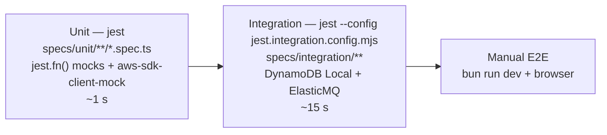

# Backend design — `backend/` workspace

The Serverless service: four Lambda functions behind API Gateway and SQS, one DynamoDB table, all in
TypeScript on the Node.js 22 runtime. This document is the _workspace_ plan — tooling, layout, configuration,
tests. The function-level design (layers, handler contracts, IAM) is in
[lambda-function-design.md](lambda-function-design.md); the data and message designs are in
[dynamodb-table-design.md](dynamodb-table-design.md) and [sqs-message-design.md](sqs-message-design.md).

## Stack

| Concern           | Choice                                                                            | Notes                                                                                                                         |
| ----------------- | --------------------------------------------------------------------------------- | ----------------------------------------------------------------------------------------------------------------------------- |
| Language          | TypeScript ~6, `strict`, `noUncheckedIndexedAccess`, `exactOptionalPropertyTypes` | Same base `tsconfig` as the frontend.                                                                                         |
| Runtime           | Node.js 22 (`nodejs22.x`)                                                         | Required by the task; matches the local Node used by Jest and the Serverless CLI.                                             |
| Framework         | Serverless Framework v4                                                           | Built-in esbuild bundling; `serverless.yml` declares functions, events, IAM, and the CloudFormation resources.                |
| HTTP              | API Gateway **HTTP API** (payload v2)                                             | Cheaper and simpler than REST API; CORS and routes declared per function.                                                     |
| Data              | DynamoDB via AWS SDK v3 (`@aws-sdk/lib-dynamodb`)                                 | Document client, so items are plain objects.                                                                                  |
| Queue             | SQS via `@aws-sdk/client-sqs`                                                     | Standard queue + DLQ.                                                                                                         |
| Validation        | zod 4 (from `@noti/shared`)                                                       | One schema for request bodies, queue messages, cursors, and env config.                                                       |
| Tests             | **Jest 30** + `@swc/jest`, `aws-sdk-client-mock`                                  | Same runner as the frontend; SWC for a fast, type-check-free transform (types are checked by `tsc`).                          |
| Lint / format     | ESLint (root flat config) + Prettier                                              | Same rules as the frontend: 160-line files, arrow functions, no unused code.                                                  |
| Scripts / install | Bun                                                                               | `bun install`, `bun run …`; the local runner is a Bun script. `jest`, `tsc`, and `serverless` run on Node via their shebangs. |
| Local emulators   | DynamoDB Local + ElasticMQ in Docker                                              | Reached through `AWS_ENDPOINT_URL_*`; no code changes.                                                                        |

## Directory structure

```
backend/
├── package.json                    scripts below; deps: zod, @aws-sdk/*; dev: jest, @swc/jest, aws-sdk-client-mock, serverless
├── tsconfig.json                   extends ../tsconfig.base.json; types: node, jest
├── serverless.yml                  service, provider, build, functions, resources, outputs
├── jest.config.mjs                 unit tests: specs/unit/**
├── jest.integration.config.mjs     integration tests: specs/integration/**, longer timeout
├── .env.local                      TABLE_NAME, QUEUE_URL, AWS_ENDPOINT_URL_* for the local runner (git-ignored; .env.example committed)
├── src/
│   ├── deps.ts                     builds { repo, queue, provider, config, now, newId } once per container
│   ├── handlers/
│   │   ├── index.ts                one namespace export per Lambda; the runner and specs import from here
│   │   ├── http/                   createNotification/ · listNotifications/ · getNotification/
│   │   └── queue/                  processNotifications/   (each: handler.ts + index.ts entry point)
│   ├── services/                   createNotification.ts · listNotifications.ts · getNotification.ts · processNotification.ts
│   ├── domain/                     lifecycle.ts
│   ├── repositories/               notificationRepository.ts · transitionUpdate.ts · item.ts · cursor.ts
│   ├── queue/                      message.ts · producer.ts
│   ├── providers/                  notificationProvider.ts · simulatedProvider.ts
│   └── lib/                        config.ts · errors.ts · http.ts · logger.ts
├── local/
│   ├── server.ts                   Bun entry: starts the HTTP server and the SQS poller
│   ├── http.ts                     CORS preflight + route → the same Lambda handlers
│   ├── poller.ts                   long-poll ElasticMQ → worker handler, delete non-failed records
│   ├── table.ts                    table definition + ensureTable() (also used by the integration harness)
│   ├── setup.ts                    CLI: create the table in DynamoDB Local if missing
│   └── elasticmq.conf              main queue + DLQ, visibility timeout, redrive policy
└── specs/
    ├── helpers/
    │   ├── mocks.ts                jest.fn() NotificationRepository, QueueProducer, NotificationProvider with safe defaults
    │   ├── events.ts               builders for APIGatewayProxyEventV2 and SQSEvent
    │   └── fixtures.ts             sample inputs and stored items per channel
    ├── unit/
    │   ├── domain/lifecycle.spec.ts
    │   ├── services/*.spec.ts
    │   ├── handlers/*.spec.ts
    │   ├── repositories/*.spec.ts  (aws-sdk-client-mock)
    │   ├── queue/*.spec.ts
    │   ├── providers/simulatedProvider.spec.ts
    │   └── lib/*.spec.ts
    └── integration/
        ├── env.ts                  emulator endpoints (Jest does not read .env files)
        ├── harness.ts              real handlers + SDK clients; recreates the table and purges the queue per file
        ├── createAndProcess.spec.ts
        ├── pagination.spec.ts
        └── retries.spec.ts
```

Every `src/` file is under the 160-line lint cap; the service files are the largest (~80–120 lines each).

## Module responsibilities

| Module                | Owns                                                                                                          | Depends on                                                       |
| --------------------- | ------------------------------------------------------------------------------------------------------------- | ---------------------------------------------------------------- |
| `handlers/`           | event → typed input; result / error → response. Thin.                                                         | `services/`, `lib/http.ts`, `deps.ts`, schemas                   |
| `services/`           | the use case (order of operations, what counts as failure)                                                    | interfaces of `repositories/`, `queue/`, `providers/`; `domain/` |
| `domain/lifecycle.ts` | the transition table: `{ enqueued: { from: ['PENDING'], to: 'QUEUED' }, … }`                                  | nothing                                                          |
| `repositories/`       | DynamoDB: item shape, key builders, `ConditionExpression`s from the transition table, cursor codec            | AWS SDK, `domain/`                                               |
| `queue/`              | message schema; `SendMessage` producer                                                                        | AWS SDK                                                          |
| `providers/`          | `NotificationProvider` interface, `ProviderError { retryable }`, the simulator                                | nothing                                                          |
| `lib/`                | config (zod-validated env), `AppError` hierarchy, `httpHandler`, JSON logger                                  | zod                                                              |
| `deps.ts`             | wires real implementations; the only place `new DynamoDBClient()` / `new SQSClient()` appear besides `local/` | everything above                                                 |

Dependency direction is strictly downward: `handlers → services → (domain | ports) → lib`. ESLint's
`import/no-restricted-paths` enforces that `services/` never imports `@aws-sdk/*` or `handlers/`.

## Configuration files

### `package.json`

```jsonc
{
  "name": "@noti/backend",
  "private": true,
  "type": "module",
  "scripts": {
    "dev": "bun run local/setup.ts && bun --watch local/server.ts",
    "test": "jest",
    "test:watch": "jest --watch",
    "test:integration": "jest --config jest.integration.config.mjs --runInBand",
    "typecheck": "tsc --noEmit",
    "lint": "eslint .",
    "lint:fix": "eslint . --fix",
    "package": "serverless package",
    "deploy": "serverless deploy --stage ${STAGE:-dev}",
    "remove": "serverless remove --stage ${STAGE:-dev}",
    "logs:worker": "serverless logs -f processNotifications --tail",
  },
  "dependencies": {
    "@aws-sdk/client-dynamodb": "^3",
    "@aws-sdk/lib-dynamodb": "^3",
    "@aws-sdk/client-sqs": "^3",
    "@noti/shared": "workspace:*",
    "zod": "^4",
  },
  "devDependencies": {
    "@swc/core": "^1",
    "@swc/jest": "^0.2",
    "jest": "^30",
    "@types/aws-lambda": "^8",
    "@types/jest": "^30",
    "@types/node": "^22",
    "aws-sdk-client-mock": "^4",
    "aws-sdk-client-mock-jest": "^4",
    "serverless": "^4",
    "typescript": "~6.0",
  },
}
```

`@aws-sdk/*` are runtime dependencies for type-checking and local runs, but are **excluded from the bundle**
(the Lambda runtime ships them). `@types/aws-lambda` supplies `APIGatewayProxyHandlerV2`, `SQSHandler`,
`SQSBatchResponse`.

### `tsconfig.json`

```jsonc
{
  "extends": "../tsconfig.base.json", // strict, ES2022, bundler resolution, noUncheckedIndexedAccess
  "compilerOptions": { "types": ["node", "jest"], "noEmit": true },
  "include": ["src", "local", "specs", "jest.*.mjs"],
}
```

### `jest.config.mjs` (unit)

```js
export default {
  testEnvironment: 'node',
  transform: { '^.+\\.ts$': ['@swc/jest', { jsc: { target: 'es2022', parser: { syntax: 'typescript' } } }] },
  extensionsToTreatAsEsm: ['.ts'],
  moduleNameMapper: { '^(\\.{1,2}/.*)\\.js$': '$1' }, // ESM-style relative imports
  roots: ['<rootDir>/specs/unit', '<rootDir>/src'],
  testMatch: ['**/*.spec.ts'],
  clearMocks: true,
  setupFilesAfterEnv: ['aws-sdk-client-mock-jest'],
  coverageThreshold: { global: { branches: 85, lines: 90 } },
  collectCoverageFrom: ['src/**/*.ts', '!src/deps.ts'],
};
```

- **`@swc/jest`** — millisecond transforms, no type checking (that is `bun run typecheck`'s job). Matches the
  frontend, where `next/jest` also uses SWC.
- **`aws-sdk-client-mock-jest`** — adds `toHaveReceivedCommandWith` matchers for asserting exact
  `UpdateItemCommand` / `QueryCommand` inputs.
- **`deps.ts` excluded from coverage** — it is wiring, covered by the integration tests.

### `jest.integration.config.mjs`

```js
import base from './jest.config.mjs';
export default {
  ...base,
  roots: ['<rootDir>/specs/integration'],
  setupFiles: ['<rootDir>/specs/integration/env.ts'],
  testTimeout: 30_000,
  coverageThreshold: undefined,
};
```

Run with `--runInBand`: the tests share one DynamoDB Local table and one ElasticMQ queue, so they must not
interleave. `env.ts` sets the emulator endpoints; `harness.ts` recreates the table and purges the queue per
file.

### `serverless.yml` skeleton

```yaml
service: noti-request-system
frameworkVersion: '4'

provider:
  name: aws
  runtime: nodejs22.x
  region: ${opt:region, 'ap-southeast-2'}
  stage: ${opt:stage, 'dev'}
  memorySize: 256
  timeout: 10
  logRetentionInDays: 14
  environment:
    TABLE_NAME: !Ref NotificationRequestsTable
    LOG_LEVEL: info
  httpApi:
    cors:
      allowedOrigins: [http://localhost:3000, ${param:frontendOrigin, 'https://noti-request-system.vercel.app'}]
      allowedMethods: [GET, POST, OPTIONS]
      allowedHeaders: [Content-Type]
      exposedHeaders: [Location]
      maxAge: 86400

build:
  esbuild:
    bundle: true
    minify: false
    sourcemap: true
    target: node22
    format: cjs
    exclude: ['@aws-sdk/*']

functions:   # see lambda-function-design.md — four functions with per-function IAM
resources:   # see dynamodb-table-design.md and sqs-message-design.md — table, queue, DLQ
  Outputs:            # HttpApiUrl is emitted by the framework itself
    QueueUrl:   { Value: !Ref NotificationRequestsQueue }
    TableName:  { Value: !Ref NotificationRequestsTable }
```

`http://localhost:3000` is always allowed so a local `next dev` can talk to the deployed API; the second
origin is the hosted frontend, overridable at deploy time
(`serverless deploy --param="frontendOrigin=https://…"`).

## Environment

| Variable                                                   | Source (AWS)              | Source (local)                                             | Used by                |
| ---------------------------------------------------------- | ------------------------- | ---------------------------------------------------------- | ---------------------- |
| `TABLE_NAME`                                               | `serverless.yml` → `!Ref` | `.env.local` = `notification-requests-local`               | all                    |
| `QUEUE_URL`                                                | `!Ref` queue              | `http://localhost:9324/000000000000/notification-requests` | create, local poller   |
| `MAX_ATTEMPTS`                                             | function env, `3`         | `.env.local`                                               | worker                 |
| `SIMULATED_FAILURE_RATE`                                   | function env, `0.2`       | `.env.local`                                               | worker                 |
| `LOG_LEVEL`                                                | provider env, `info`      | `debug`                                                    | all                    |
| `AWS_ENDPOINT_URL_DYNAMODB` / `AWS_ENDPOINT_URL_SQS`       | unset                     | `http://localhost:8000` / `http://localhost:9324`          | AWS SDK, automatically |
| `AWS_REGION`, `AWS_ACCESS_KEY_ID`, `AWS_SECRET_ACCESS_KEY` | Lambda runtime            | `local` / dummy values (emulators ignore them)             | AWS SDK                |

`lib/config.ts` parses these with a zod schema at module load; a missing `TABLE_NAME` fails the first
invocation with `Invalid configuration: TABLE_NAME is required` rather than an SDK error later.

## Testing with Jest



### Unit — what each suite asserts

| Suite                                            | Cases                                                                                                                                                                                                                                                                                           | Doubles                           |
| ------------------------------------------------ | ----------------------------------------------------------------------------------------------------------------------------------------------------------------------------------------------------------------------------------------------------------------------------------------------- | --------------------------------- |
| `domain/lifecycle`                               | every allowed transition; every forbidden one throws / returns conflict; terminal states never move                                                                                                                                                                                             | none                              |
| `services/createNotification`                    | PENDING put → send → QUEUED update, in that order; send failure → FAILED + `EnqueueFailedError`; ids and timestamps come from `deps.newId` / `deps.now`                                                                                                                                         | `jest.fn()` repo + queue mocks    |
| `services/processNotification`                   | claim → sent; permanent error → failed; transient with attempts left → retry; transient on 3rd attempt → failed; claim conflict → skipped                                                                                                                                                       | mocks; provider stubbed per test  |
| `services/listNotifications` / `getNotification` | limit passthrough; cursor passthrough; not found → `NotFoundError`                                                                                                                                                                                                                              | repo fake                         |
| `handlers/http/*`                                | `202` + `Location`; `400` `VALIDATION_ERROR` with every `details` entry; `413` at 32 KB + 1; `INVALID_JSON`; `404`; unknown error → `500` with generic body and `requestId`                                                                                                                     | services stubbed with `jest.fn()` |
| `handlers/queue/processNotifications`            | one failing record of three → exactly one `batchItemFailures` entry; unparseable body → reported; never throws                                                                                                                                                                                  | service stubbed                   |
| `repositories/notificationRepository`            | exact `PutItemCommand` / `UpdateItemCommand` inputs (`ConditionExpression`, `ExpressionAttributeValues`); `ConditionalCheckFailedException` → conflict result; `QueryCommand` on the index with `ScanIndexForward: false`; cursor encode/decode round-trip; tampered cursor → `ValidationError` | `aws-sdk-client-mock`             |
| `queue/producer`                                 | `SendMessageCommand` with the JSON body and queue URL                                                                                                                                                                                                                                           | `aws-sdk-client-mock`             |
| `providers/simulatedProvider`                    | `fail@` → permanent; seeded RNG → transient; otherwise accepted with an id                                                                                                                                                                                                                      | `deps.random` injected            |
| `lib/http`, `lib/config`, `lib/errors`           | wrapper mapping table; env parsing; error → status/code                                                                                                                                                                                                                                         | none                              |

Pattern for a service test — every dependency is a `jest.fn()` with a harmless default (`makeDeps` in
`specs/helpers/mocks.ts`); a test stubs only the calls it needs and asserts the calls it expects:

```ts
const deps = makeDeps();
deps.repo.transition.mockResolvedValueOnce(transitioned(stored({ status: 'PROCESSING', attempts: 2 })));
deps.provider.send.mockRejectedValueOnce(new ProviderError('Provider timeout', true));

await expect(processNotification(deps, { notificationId: ID })).resolves.toBe('retry');

expect(deps.repo.transition).toHaveBeenNthCalledWith(2, ID, 'retryScheduled', {
  now: NOW,
  lastError: 'Provider timeout',
});
```

The tests are interaction-based on purpose: the service's contract is _which_ transition it asks for and
_when_ (before or after the provider call), and the transition rules themselves are covered once, in
`domain/lifecycle.spec.ts` and the repository's `ConditionExpression` tests.

### Integration — the real pipeline

| Test               | Flow                                                                                                                                                                                                               |
| ------------------ | ------------------------------------------------------------------------------------------------------------------------------------------------------------------------------------------------------------------ |
| `createAndProcess` | call the create handler with a real event → assert item `QUEUED` in DynamoDB Local and one message in ElasticMQ → receive it, build an `SQSEvent`, call the worker handler → assert `SENT` and `providerMessageId` |
| `retries`          | `SIMULATED_FAILURE_RATE=1` → worker returns the record in `batchItemFailures`, item is `QUEUED` with `attempts: 1`; after three passes the item is `FAILED` and the record is **not** reported                     |
| `pagination`       | create 25 → list `limit=10` three times following `nextCursor` → 10 / 10 / 5, `null` at the end, newest first, no duplicates                                                                                       |
| `conflicts`        | claim the same id twice concurrently → exactly one succeeds                                                                                                                                                        |

The handlers are invoked directly (no HTTP server), which keeps these tests fast and free of port juggling;
the local runner is exercised manually.

## Local development

`bun run dev` (from `backend/`) or `bun run dev:backend` (root):

1. `local/setup.ts` — `CreateTable` on DynamoDB Local if the table is missing (same keys and GSI as
   `serverless.yml`).
2. `local/server.ts` — `Bun.serve` on `:3001`: CORS preflight, route → handler, response mapping; plus a
   long-polling loop on ElasticMQ that builds `SQSEvent`s and deletes non-failed records.

Both read `.env.local`. The runner is a Bun script because Bun runs TypeScript directly and `--watch` restarts
on change; nothing in `local/` ships to AWS.

## CI (GitHub Actions, outline)

```
install (bun) → typecheck → lint → jest (unit) → docker compose up → jest (integration) → serverless package
```

`serverless package` validates `serverless.yml` and the bundle without deploying; deploy is a manual step
until credentials and a stage are agreed.

## Alternatives considered

| Alternative                                        | Why not                                                                                                                                                                                    |
| -------------------------------------------------- | ------------------------------------------------------------------------------------------------------------------------------------------------------------------------------------------ |
| `bun test` for the backend                         | Fast and zero-config, but the frontend needs Jest anyway; one runner, one assertion library, one mocking API across the repo is worth more than the speed difference on a ~100-test suite. |
| `ts-jest`                                          | Type-checks during tests (slow); `tsc --noEmit` already does that once. `@swc/jest` matches the frontend's SWC transform.                                                                  |
| Vitest                                             | Excellent, but Jest is the frontend's runner via `next/jest`.                                                                                                                              |
| `serverless-offline`                               | Emulates API Gateway + Lambda in-process but not SQS event source mappings; the Bun runner does both in ~120 lines and invokes the identical handlers.                                     |
| LocalStack                                         | Full AWS emulation, heavier to run; DynamoDB Local + ElasticMQ cover exactly the two services used.                                                                                        |
| AWS SAM / CDK                                      | The task names Serverless Framework.                                                                                                                                                       |
| Middy middleware                                   | Replaces ~60 lines of `lib/http.ts`; not worth a dependency.                                                                                                                               |
| Mocking the AWS SDK with `jest.mock('@aws-sdk/…')` | `aws-sdk-client-mock` mocks at the command level with typed matchers; hand-rolled module mocks are brittle.                                                                                |
