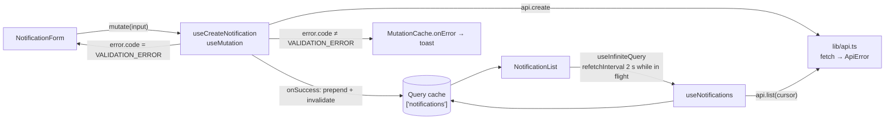

# Frontend design — `frontend/`

A statically exported **Next.js (App Router)** app in TypeScript: one page with a form and a live-updating
list. **react-hook-form + zod** drive the form, **Tailwind CSS + shadcn/ui** the look, **TanStack Query** the
data. Tooling: **Bun** runs everything, **ESLint + Prettier** keep the code uniform, **Jest + Testing
Library** test it.

## Stack

| Concern                   | Choice                                                              | Notes                                                                                                                                                                                                |
| ------------------------- | ------------------------------------------------------------------- | ---------------------------------------------------------------------------------------------------------------------------------------------------------------------------------------------------- |
| Framework                 | Next.js 16, App Router, `output: 'export'`                          | Static files; no server at runtime. Every component that touches data is a Client Component.                                                                                                         |
| Language                  | TypeScript, `strict` + `noUncheckedIndexedAccess`                   | Same compiler options as the backend.                                                                                                                                                                |
| Server state              | TanStack Query 5                                                    | List polling, create mutation, cache invalidation, global error handling.                                                                                                                            |
| Form                      | react-hook-form 7 + `@hookform/resolvers/zod`                       | The shared zod schema is the resolver, so the form validates with exactly the API's rules; RHF handles registration, dirty/pending state, and per-field errors (including ones set from the server). |
| Validation                | zod 4 (`@noti/shared`)                                              | One schema for form, API, and types.                                                                                                                                                                 |
| Styling                   | Tailwind CSS 4                                                      | Utility classes, CSS-first config (`@import "tailwindcss"` + `@theme` in `globals.css`), no `tailwind.config`.                                                                                       |
| Components                | shadcn/ui                                                           | Copied into `src/components/ui/`, not a dependency: Button, Input, Textarea, Label, Field, RadioGroup, Badge, Card, Sonner. Accessible (Radix) and ours to edit.                                     |
| Toasts                    | shadcn `Sonner`                                                     | Already part of the kit.                                                                                                                                                                             |
| Package manager / scripts | Bun                                                                 | `bun install`, `bun run …`. Bun respects the `#!/usr/bin/env node` shebang of `jest` and `next`, so both run on Node exactly as in CI.                                                               |
| Lint                      | ESLint 9 (flat config) + `typescript-eslint` + `eslint-config-next` | Rules below. ESLint 9, not 10: `eslint-config-next`'s plugins (`eslint-plugin-react`) still use APIs removed in 10.                                                                                  |
| Format                    | Prettier                                                            | Formatting is not a lint concern; `eslint-config-prettier` disables the overlapping rules.                                                                                                           |
| Tests                     | Jest 30 via `next/jest` (SWC), `jsdom`, Testing Library             | `next/jest` reads `next.config.ts`, so path aliases and CSS imports work in tests without extra mapping.                                                                                             |

## Directory structure

```
frontend/
├── package.json
├── next.config.ts              output: 'export', reactStrictMode: true
├── tsconfig.json               extends ../tsconfig.base.json; paths: @/* → src/*
├── eslint.config.mjs           extends the root config, adds Next.js rules
├── postcss.config.mjs          @tailwindcss/postcss
├── components.json             shadcn/ui config (style, aliases, Tailwind v4)
├── jest.config.mjs             next/jest wrapper — see Testing
├── jest.setup.ts               @testing-library/jest-dom matchers, fetch mock reset
├── .env.example                NEXT_PUBLIC_API_URL=http://localhost:3001
├── public/
└── src/
    ├── app/
    │   ├── layout.tsx          html/body, <Providers>, <Toaster>
    │   ├── page.tsx            composes <NotificationForm /> and <NotificationList />
    │   ├── providers.tsx       'use client' — QueryClientProvider with the global MutationCache
    │   └── globals.css         @import "tailwindcss"; shadcn theme tokens; status colour tokens
    ├── components/
    │   ├── notification-form/
    │   │   ├── NotificationForm.tsx     useForm + zodResolver, submit, server errors → setError
    │   │   ├── UserIdField.tsx          who is sending; kept across submissions (stand-in for a signed-in user)
    │   │   ├── ChannelField.tsx         Email / SMS / Push radio group; the other fields follow the choice
    │   │   ├── RecipientField.tsx       label, hint and input type per channel
    │   │   └── MessageFields.tsx        subject (unmounted for SMS) + message with counter
    │   ├── notification-list/
    │   │   ├── NotificationList.tsx     useNotifications(filter), empty/loading/error states, owns the user filter
    │   │   ├── UserFilter.tsx           search input + clear; validated with userIdSchema before it reaches the API
    │   │   ├── NotificationRow.tsx      one item; shows attempts and lastError when present
    │   │   ├── StatusBadge.tsx          shadcn Badge variant per status, role="status"
    │   │   └── LoadMoreButton.tsx       fetches the next cursor page
    │   └── ui/                          shadcn/ui primitives (generated by `bunx shadcn add …`)
    │       ├── button.tsx  input.tsx  textarea.tsx  label.tsx  radio-group.tsx
    │       ├── field.tsx                Field / FieldLabel / FieldDescription / FieldError (+ FieldSet, FieldLegend)
    │       └── badge.tsx  card.tsx  sonner.tsx
    ├── hooks/
    │   ├── useNotifications.ts          useInfiniteQuery + refetchInterval while non-terminal
    │   └── useCreateNotification.ts     useMutation + prepend into the cache
    ├── lib/
    │   ├── api.ts                       typed fetch client, ApiError, Register augmentation
    │   ├── queryKeys.ts                 ['notifications'] and friends, in one place
    │   ├── format.ts                    relative time, truncate, channel labels
    │   ├── utils.ts                     cn() — shadcn's clsx + tailwind-merge helper
    │   └── env.ts                       NEXT_PUBLIC_API_URL, validated at import
    └── schemas/                         re-exports from the shared workspace (see below)
```

Files are small on purpose — the lint rule caps every file at 160 lines, so a component that grows splits
along the seams shown above (the form into recipient/message pieces, the list into row/badge/pager).

### Shared schemas

`createNotificationSchema`, the `Notification` type, and the status/channel constants live in a workspace
package (`@noti/shared`) consumed by both `frontend/` and `backend/`. The frontend never redefines a rule; it
imports the schema for instant validation and the types for the API client. `src/schemas/index.ts` is a
one-line re-export so components import from `@/schemas`, keeping the workspace boundary in one file.

## Data flow



- **Create** — `useMutation`; on success the returned item is prepended to the first page of the list cache
  (instant feedback, and it covers the GSI's eventual consistency), then the list is invalidated.
- **List** — `useInfiniteQuery` keyed on `['notifications']`,
  `getNextPageParam: (last) => last.nextCursor ?? undefined`. `refetchInterval` returns `2000` while any
  loaded item is non-terminal, else `false`. Only the first page is refetched on the interval; older pages are
  stable by construction (cursor pagination).
- **Errors** — validation errors are derived from `mutation.error` inside the form; everything else is one
  toast from the global `MutationCache` (see
  [api-contract-and-validation.md](api-contract-and-validation.md#frontend-mapping)).

## Components — responsibilities

| Component                          | Owns                                                                                                                                                                                                        | Does not                                               |
| ---------------------------------- | ----------------------------------------------------------------------------------------------------------------------------------------------------------------------------------------------------------- | ------------------------------------------------------ |
| `NotificationForm`                 | `useForm({ resolver: zodResolver(createNotificationSchema) })`, `handleSubmit → mutate`, server `details[]` → `setError`, `isSubmitting`/`isPending` on the button, `reset()` on success (keeping `userId`) | render the fields' markup (delegated), talk to `fetch` |
| `UserIdField`                      | the sender's id; the demo's stand-in for a signed-in user — with an authorizer the field goes away and the token supplies it                                                                                | hold state                                             |
| `ChannelField`                     | the Email / SMS / Push radio group (`Controller` over a Radix `RadioGroup`); `RecipientField` and `MessageFields` read the watched value and swap labels, hints, limits and the subject field accordingly   | know what each channel needs (the fields do)           |
| `RecipientField` / `MessageFields` | markup via shadcn `Field*`, per-channel labels/hints/limits, character counters from `useWatch()`                                                                                                           | hold state (they receive `control` / `register`)       |
| `NotificationList`                 | loading / empty / error states, mapping pages to rows, the load-more button, the user filter (debounced 300 ms, validated with `userIdSchema`, passed to `useNotifications`)                                | polling logic (in the hook)                            |
| `UserFilter`                       | the search input, its clear button, and the inline validation message                                                                                                                                       | state (controlled by the list)                         |
| `NotificationRow`                  | one item's layout: channel icon, recipient, sender (`userId`, click to filter), subject/message preview, `StatusBadge`, attempts, `lastError`, relative time                                                | fetching                                               |
| `StatusBadge`                      | colour + text per status; `role="status"` so screen readers announce changes                                                                                                                                | anything else                                          |
| shadcn `Field*`                    | label, control slot, description, `FieldError` (`role="alert"`) — generated once, reused by every field; inputs get `aria-invalid` from RHF's `errors`                                                      | validation                                             |

Accessibility baseline: every input has a label, errors are linked via `aria-describedby`, the status badge is
a live region, and the submit button is disabled (not hidden) while pending.

## Form — react-hook-form + zod

```tsx
const form = useForm<CreateNotificationInput>({
  resolver: zodResolver(createNotificationSchema),
  defaultValues: { userId: '', channel: 'EMAIL', recipient: '', subject: '', message: '' },
  mode: 'onBlur',
});
const create = useCreateNotification();
const channel = form.watch('channel');

const onSubmit = form.handleSubmit((values) =>
  create.mutate(values, {
    onSuccess: () => form.reset(),
    onError: (e) => {
      if (e.code !== 'VALIDATION_ERROR') return; // toast handled globally
      for (const d of e.details ?? [])
        form.setError(d.path as keyof CreateNotificationInput, { message: d.message });
    },
  }),
);
```

- **The resolver is the shared schema** — the form cannot drift from the API. `mode: 'onBlur'` gives per-field
  feedback without flashing errors while typing.
- **Discriminated union and the subject field.** The form edits a flat `NotificationFormValues` shape; the
  resolver validates against the union
  (`zodResolver<NotificationFormValues, unknown, CreateNotificationInput>`). `shouldUnregister: true` plus
  conditional rendering means that when `channel` becomes `SMS` the unmounted subject input drops out of the
  values, so the strict SMS schema receives no `subject` key.
- **Server errors land in the same place as client errors.** `setError(path, { message })` renders through the
  same `FormMessage`; the user cannot tell which side rejected the field — which is the point.
- **Values are typed by the schema** (`CreateNotificationInput`), so `mutate(values)` needs no cast.

## Styling — Tailwind CSS 4 + shadcn/ui

- **Tailwind v4 is CSS-first**: `globals.css` starts with `@import "tailwindcss";` and defines tokens in
  `@theme` (colours, radius) — no `tailwind.config.*`. `postcss.config.mjs` registers `@tailwindcss/postcss`.
- **shadcn/ui components are source files**, added with
  `bunx shadcn@latest add button input textarea label radio-group field badge card sonner`. They live in
  `src/components/ui/`, are linted and formatted like any other file, and can be edited freely.
  `components.json` records the style/aliases so later `add` commands match.
- **Status colours are tokens**, not ad-hoc classes: `--status-queued`, `--status-sent`, … in `@theme`, used
  by a `StatusBadge` `variant` map. One place to change the palette.
- **`cn()`** (`lib/utils.ts`) merges conditional classes without duplicates — the only styling helper.
- **`prettier-plugin-tailwindcss`** sorts class lists, so diffs stay readable.
- Radix primitives (RadioGroup, etc.) work in `jsdom` with two small polyfills in `jest.setup.ts`
  (`ResizeObserver`, `window.matchMedia`). `Select` is avoided in favour of `RadioGroup` for the three
  channels — three options fit on screen and RadioGroup needs no pointer-event shims in tests.

## Lint — ESLint

Flat config at the repo root (`eslint.config.mjs`) so the backend gets the same base rules; the frontend adds
Next.js rules on top. ESLint 9 does not pick the nearest config per file, so the root `lint` script fans out
(`bun run --filter '*' lint`) and each workspace lints with its own config.

```js
// eslint.config.mjs (root)
import js from '@eslint/js';
import tseslint from 'typescript-eslint';
import unusedImports from 'eslint-plugin-unused-imports';
import preferArrow from 'eslint-plugin-prefer-arrow-functions';
import prettier from 'eslint-config-prettier';

export default tseslint.config(
  { ignores: ['**/node_modules/', '**/.next/', '**/out/', '**/.serverless/', '**/coverage/'] },
  js.configs.recommended,
  ...tseslint.configs.recommendedTypeChecked,
  {
    languageOptions: { parserOptions: { projectService: true } },
    plugins: { 'unused-imports': unusedImports, 'prefer-arrow-functions': preferArrow },
    rules: {
      // file size
      'max-lines': ['error', { max: 160, skipBlankLines: true, skipComments: true }],

      // arrow functions everywhere
      'func-style': ['error', 'expression'],
      'prefer-arrow-callback': ['error', { allowNamedFunctions: false }],
      'prefer-arrow-functions/prefer-arrow-functions': [
        'error',
        { classPropertiesAllowed: true, disallowPrototype: true, returnStyle: 'unchanged' },
      ],

      // unused imports, variables, functions, parameters → error (with auto-fix for imports)
      '@typescript-eslint/no-unused-vars': 'off',
      'unused-imports/no-unused-imports': 'error',
      'unused-imports/no-unused-vars': [
        'error',
        {
          vars: 'all',
          varsIgnorePattern: '^_',
          args: 'after-used',
          argsIgnorePattern: '^_',
          caughtErrors: 'all',
        },
      ],
    },
  },
  prettier,
);
```

```js
// frontend/eslint.config.mjs
import { globalIgnores } from 'eslint/config';
import nextVitals from 'eslint-config-next/core-web-vitals';
import base from '../eslint.config.mjs';

const config = [
  ...base,
  ...nextVitals,
  globalIgnores(['.next/**', 'out/**', 'next-env.d.ts']),
  {
    // shadcn/ui components are generated code: function declarations, and field.tsx is > 160 lines.
    files: ['src/components/ui/**'],
    rules: {
      'max-lines': 'off',
      'func-style': 'off',
      'prefer-arrow-functions/prefer-arrow-functions': 'off',
      'prefer-arrow-callback': 'off',
    },
  },
];

export default config;
```

| Rule                                                                          | Setting                                   | Why                                                                                                                                                                                                                                |
| ----------------------------------------------------------------------------- | ----------------------------------------- | ---------------------------------------------------------------------------------------------------------------------------------------------------------------------------------------------------------------------------------- |
| `max-lines`                                                                   | 160, blank lines and comments not counted | Forces components and modules to split at their natural seams; a 160-line file is readable in one screen-and-a-half.                                                                                                               |
| `func-style: expression` + `prefer-arrow-callback` + `prefer-arrow-functions` | error                                     | One function style: `const fn = () => …`. Arrow functions have no `this`/`arguments` surprises, and `const` prevents accidental redeclaration. Page components are `const Page = () => …; export default Page;`.                   |
| `unused-imports/no-unused-imports`                                            | error, auto-fixable                       | `eslint --fix` deletes dead imports instead of just flagging them.                                                                                                                                                                 |
| `unused-imports/no-unused-vars`                                               | error; `_`-prefixed names allowed         | Covers unused variables, **functions** (an unreferenced `const helper = () => …` is an unused variable), and parameters after the last used one. `_` prefix is the explicit "intentionally unused" marker for callback signatures. |
| `@typescript-eslint/no-unused-vars`                                           | off                                       | Replaced by the plugin above to avoid double reports.                                                                                                                                                                              |
| `recommendedTypeChecked`                                                      | on                                        | Catches floating promises (`mutate` vs `mutateAsync`), unsafe `any`, and misused promises in event handlers — the bugs a React + async app actually has.                                                                           |
| `eslint-config-next/core-web-vitals`                                          | frontend only                             | Next.js-specific rules (`next/image`, hooks rules, no sync scripts).                                                                                                                                                               |
| `eslint-config-prettier`                                                      | last                                      | Turns off every formatting rule so ESLint and Prettier never disagree.                                                                                                                                                             |

Exported-but-unused _across files_ is outside ESLint's per-file view; `bunx knip` is the tool for that and is
run in CI, not on save.

## Tests — Jest

```js
// frontend/jest.config.mjs
import nextJest from 'next/jest.js';

const createJestConfig = nextJest({ dir: './' });

export default createJestConfig({
  testEnvironment: 'jsdom',
  setupFilesAfterEnv: ['<rootDir>/jest.setup.ts'],
  testMatch: ['<rootDir>/specs/**/*.spec.{ts,tsx}'],
  moduleNameMapper: { '^@/(.*)$': '<rootDir>/src/$1' },
  clearMocks: true,
});
```

```ts
// frontend/jest.setup.ts
import '@testing-library/jest-dom';

class ResizeObserverStub {
  observe() {}
  unobserve() {}
  disconnect() {}
}
global.ResizeObserver = ResizeObserverStub as unknown as typeof ResizeObserver; // Radix primitives
window.matchMedia ??= () =>
  ({ matches: false, addEventListener() {}, removeEventListener() {} }) as MediaQueryList;

beforeEach(() => {
  global.fetch = jest.fn();
});
```

`next/jest` configures SWC for TS/TSX, stubs CSS and static assets, and loads `.env.test` — no `ts-jest`, no
Babel. `bun run test` executes the `jest` binary, which runs on Node because Bun honours its shebang; the
result is identical to `npx jest` in CI.

### What is tested and how

| Suite                                        | Cases                                                                                                                                                                                                                                                              | Technique                                                           |
| -------------------------------------------- | ------------------------------------------------------------------------------------------------------------------------------------------------------------------------------------------------------------------------------------------------------------------ | ------------------------------------------------------------------- |
| `specs/lib/api.spec.ts`                      | 202 → returns `data`; 400 → throws `ApiError` with `code` and `details`; network failure → `ApiError('NETWORK_ERROR')`; `Location` handling                                                                                                                        | `fetch` mocked with `Response` objects                              |
| `specs/hooks/useNotifications.spec.tsx`      | polls while an item is `QUEUED`, stops when all terminal; `nextCursor` → `fetchNextPage`                                                                                                                                                                           | `renderHook` with a fresh `QueryClient` per test; fake timers       |
| `specs/hooks/useCreateNotification.spec.tsx` | success prepends into the cache and invalidates; error surfaces on `mutation.error`                                                                                                                                                                                | same                                                                |
| `specs/components/NotificationForm.spec.tsx` | switching to SMS removes the subject field from the DOM and the submitted values; invalid email shows the schema's message on blur and blocks submit; server `VALIDATION_ERROR` lands on the right `FormMessage`; submit disabled while pending; resets on success | `render` + `userEvent`, `fetch` mocked; real `useForm` and resolver |
| `specs/components/NotificationList.spec.tsx` | loading, empty, error, rows with badges; `lastError` shown on `FAILED`; load-more appears only with a cursor                                                                                                                                                       | `render` inside a `QueryClientProvider` with pre-seeded cache       |
| `specs/components/StatusBadge.spec.tsx`      | label/colour per status; `role="status"`                                                                                                                                                                                                                           | `render`                                                            |

Rule of thumb: components are tested through the DOM the user sees (Testing Library queries by role/label),
never by implementation details; hooks are tested with the real `QueryClient`, only `fetch` is faked.

## Scripts

```jsonc
// frontend/package.json
{
  "scripts": {
    "dev": "next dev",
    "build": "next build", // → out/ (static export)
    "start": "bunx serve out", // preview the export locally
    "test": "jest",
    "test:watch": "jest --watch",
    "typecheck": "tsc --noEmit",
    "lint": "eslint .",
    "lint:fix": "eslint . --fix",
    "format": "prettier --write .",
  },
}
```

`.prettierrc` (root):
`{ "plugins": ["prettier-plugin-tailwindcss"], "singleQuote": true, "printWidth": 110 }`.

Root `package.json` fans out: `bun run --filter '*' test`, `lint`, `typecheck`.

## Configuration and environment

| Item                  | Value                                                                                                                                                                                          |
| --------------------- | ---------------------------------------------------------------------------------------------------------------------------------------------------------------------------------------------- |
| `NEXT_PUBLIC_API_URL` | Base URL of the API. `.env.local` for a deployed API, default `http://localhost:3001` for the local runner. Read once in `lib/env.ts`; a missing value in `production` builds fails the build. |
| `next.config.ts`      | `output: 'export'`, `reactStrictMode: true`, `images: { unoptimized: true }` (no image optimiser in a static export).                                                                          |
| Deployment            | `bun run build` → `out/`; host on S3 + CloudFront, Vercel, or Netlify. No server component depends on request-time data, so the export is complete.                                            |

## Alternatives considered

| Alternative                                       | Why not                                                                                                                                                                   |
| ------------------------------------------------- | ------------------------------------------------------------------------------------------------------------------------------------------------------------------------- |
| `bun test` for the frontend                       | Faster, but no `jsdom` preset, no `next/jest` transforms for CSS imports and aliases; Jest is the path Next.js documents and supports.                                    |
| Vitest                                            | Excellent, but Jest is already the Next.js-documented runner and the user's stated choice; one runner is enough.                                                          |
| Biome for lint + format                           | Fast and single-config, but it cannot express `prefer-arrow-functions` or type-aware rules (`no-floating-promises`), which are the rules that catch real bugs here.       |
| `useState` + manual `safeParse`                   | Works for five fields, but re-implements registration, touched/dirty tracking, and error plumbing that RHF provides, and the server-error mapping ends up bespoke.        |
| CSS Modules                                       | Zero config, but every component needs its own stylesheet and the form/list/badge would be hand-built; shadcn gives accessible primitives that are still owned as source. |
| A component library as a dependency (MUI, Chakra) | Runtime CSS-in-JS or a large theme layer; shadcn's copy-in model keeps the bundle to what is used.                                                                        |
| Formik                                            | Older API, more re-renders; RHF's uncontrolled model fits a small form better.                                                                                            |
| Global state (Zustand/Redux)                      | There is no client state beyond the form; server state is TanStack Query's job.                                                                                           |
| SSR / Server Components for the list              | Would need a Node server, and the list changes every 2 s — it is client state by nature.                                                                                  |
