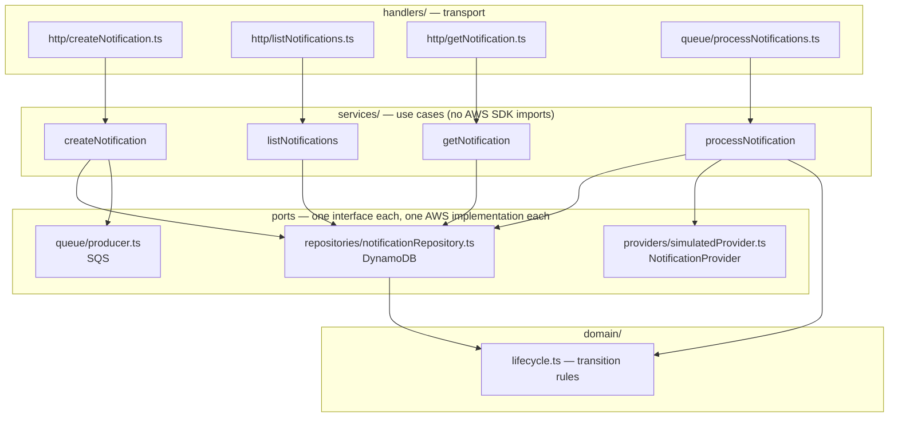

# Lambda function design — `backend/`

Four functions, one per unit of work. Each gets only the permissions, environment, and code its job needs;
all four share the same layered source tree so the business rules are written once and tested without AWS.

## The functions

| Function               | Trigger                   | Does                                                                                           | Reads / writes                                                           | Timeout · memory |
| ---------------------- | ------------------------- | ---------------------------------------------------------------------------------------------- | ------------------------------------------------------------------------ | ---------------- |
| `createNotification`   | `POST /notifications`     | Validate body → `PutItem PENDING` → `SendMessage` → `UpdateItem QUEUED` → `202`                | DynamoDB `PutItem`, `UpdateItem`; SQS `SendMessage`                      | 10 s · 256 MB    |
| `listNotifications`    | `GET /notifications`      | Validate query → `Query byCreatedAt` (or `byUser` when `?userId=`) desc → page + opaque cursor | DynamoDB `Query` on the indexes only                                     | 10 s · 256 MB    |
| `getNotification`      | `GET /notifications/{id}` | Validate id → `GetItem` → `200` or `404`                                                       | DynamoDB `GetItem`                                                       | 10 s · 256 MB    |
| `processNotifications` | SQS batch (≤ 10)          | Per record: claim → provider → record outcome; return `batchItemFailures`                      | DynamoDB `UpdateItem`; SQS receive/delete (via the event source mapping) | 10 s · 256 MB    |

Why not one function with a router: per-function IAM (the read paths _cannot_ write; only the API can
enqueue), per-function CloudWatch metrics and logs, and smaller bundles. Four functions is still small enough
that the duplication (one entry file each) is trivial.

Why these sizes: every handler does two or three fast network calls; 256 MB gives a proportionally faster
vCPU share for cold starts without paying for memory nobody uses. 10 s is generous for the API functions and,
for the worker, is the number the queue's 60 s visibility timeout is derived from (≥ 6×).

## Layering



| Layer                                | Responsibility                                                                                | Knows about                                             | Never does                           |
| ------------------------------------ | --------------------------------------------------------------------------------------------- | ------------------------------------------------------- | ------------------------------------ |
| **handlers**                         | Turn an API Gateway / SQS event into typed input; turn a result or `AppError` into a response | Event shapes, HTTP status codes, the envelope           | Business rules, AWS data-plane calls |
| **services**                         | The use case: what happens, in what order, what counts as failure                             | Repository / queue / provider **interfaces**, `domain/` | Import `@aws-sdk/*`; parse HTTP      |
| **domain**                           | The lifecycle table — which status may move to which, and who may do it                       | Nothing else                                            | I/O                                  |
| **repositories / queue / providers** | One interface each, one AWS (or simulated) implementation each                                | AWS SDK v3, key layout, condition expressions           | Business decisions                   |
| **lib**                              | Config, error types, HTTP helpers, logger — shared plumbing                                   | —                                                       | —                                    |

The rule that makes this testable: **services receive their dependencies as arguments**. Unit tests pass
`jest.fn()` mocks; the handlers pass the real AWS-backed implementations built once in `deps.ts`.

## Source tree

```
backend/
├── serverless.yml                  functions, events, per-function IAM, resources (table, queues), outputs
├── package.json                    scripts: dev, test, test:integration, typecheck, deploy
├── tsconfig.json
├── src/
│   ├── deps.ts                     builds the real dependency set once per container (module scope)
│   ├── handlers/
│   │   ├── http/
│   │   │   ├── createNotification.ts
│   │   │   ├── listNotifications.ts
│   │   │   └── getNotification.ts
│   │   └── queue/
│   │       └── processNotifications.ts
│   ├── services/
│   │   ├── createNotification.ts
│   │   ├── listNotifications.ts
│   │   ├── getNotification.ts
│   │   └── processNotification.ts  (singular: one record at a time; the handler loops)
│   ├── domain/
│   │   └── lifecycle.ts            transitions table + `allowedFrom(transition)`
│   ├── repositories/
│   │   ├── notificationRepository.ts   interface + DynamoDB implementation
│   │   ├── transitionUpdate.ts         UpdateItem expression + condition for each lifecycle transition
│   │   ├── item.ts                 item ↔ DTO mapping, key builders
│   │   └── cursor.ts               LastEvaluatedKey ↔ base64url cursor (validated)
│   ├── queue/
│   │   ├── message.ts              queueMessageSchema
│   │   └── producer.ts             interface + SQS implementation
│   ├── providers/
│   │   ├── notificationProvider.ts interface, ProviderError { retryable }
│   │   └── simulatedProvider.ts
│   ├── schemas/                    zod: createNotification, listQuery, notificationId, DTOs, constants
│   └── lib/
│       ├── config.ts               env → typed config, validated once at cold start
│       ├── errors.ts               AppError hierarchy
│       ├── http.ts                 httpHandler() wrapper, parseJsonBody(), respond(), error envelope
│       └── logger.ts               JSON lines to stdout with requestId
├── local/
│   ├── server.ts                   Bun HTTP server + SQS poller → the same handlers
│   ├── setup.ts                    creates the table in DynamoDB Local
│   └── elasticmq.conf
└── specs/
    ├── unit/                       services (jest.fn() mocks), domain, handlers, repositories (aws-sdk-client-mock)
    └── integration/                against DynamoDB Local + ElasticMQ
```

`schemas/` lives inside the backend for now; when the frontend is added it moves to a shared workspace so both
sides validate with the same code.

## Handler contracts

### HTTP — `lib/http.ts`

Every HTTP handler is `httpHandler(async (req) => Result)`. The wrapper owns everything that is the same for
all three functions:

```ts
export const handler = httpHandler(async (req) => {
  const input = createNotificationSchema.parse(parseJsonBody(req)); // ZodError → 400 VALIDATION_ERROR
  const notification = await createNotification(deps, input);
  return {
    status: 202,
    body: { data: notification },
    headers: { location: `/notifications/${notification.id}` },
  };
});
```

`httpHandler` does, in order:

1. Take `requestContext.requestId` as the correlation id and bind it to the logger.
2. Reject a body over `MAX_BODY_BYTES` → `413 PAYLOAD_TOO_LARGE` (checked on the raw string before parsing).
3. Run the function.
4. Map the outcome to a response:
   - the returned `{ status, body, headers }` → JSON with `content-type: application/json`
   - `ZodError` → `400 VALIDATION_ERROR` with `details[{ path, message }]`
   - `AppError` → its `status` and `code`
   - anything else → log at `error` with the stack, respond `500 INTERNAL_ERROR` with a generic message

The envelope (`{ data }` / `{ error: { code, message, details?, requestId } }`) is produced only here, so no
handler can get it wrong.

### SQS — `handlers/queue/processNotifications.ts`

```ts
export const handler: SQSHandler = async (event) => {
  const failures: SQSBatchItemFailure[] = [];
  for (const record of event.Records) {
    const outcome = await processRecord(deps, record); // never throws
    if (outcome === 'retry') failures.push({ itemIdentifier: record.messageId });
  }
  return { batchItemFailures: failures };
};
```

`processRecord` parses the body, calls the `processNotification` service, and maps its result to
`'done' | 'retry'` exactly as the table in [sqs-message-design.md](sqs-message-design.md#how-the-worker-handles-one-record)
specifies. Records are processed sequentially — a batch is at most 10 quick operations, and sequential keeps
provider concurrency predictable. The handler never throws; a thrown error would fail the whole batch.

## Errors — `lib/errors.ts`

```
AppError { status, code, message, details? }
├── InvalidJsonError        400 INVALID_JSON
├── ValidationError         400 VALIDATION_ERROR   (built from ZodError, or thrown by cursor decoding)
├── NotFoundError           404 NOT_FOUND
├── PayloadTooLargeError    413 PAYLOAD_TOO_LARGE
└── EnqueueFailedError      503 ENQUEUE_FAILED

ProviderError { retryable: boolean, message }       (providers/ — never reaches HTTP)
```

`ProviderError.retryable` is the single bit that decides between `retryScheduled` and `failed` in the worker.
`ConditionalCheckFailedException` from the SDK is caught inside the repository and surfaced as a typed
`TransitionConflict` result, not an exception — the service treats it as "someone else got there first".

## Dependencies — `deps.ts`

```ts
export type Deps = {
  repo: NotificationRepository;
  queue: QueueProducer;
  provider: NotificationProvider;
  config: Config;
  now: () => Date;
  newId: () => string;
};

export const deps: Deps = buildDeps(); // module scope: clients are created once per container
```

- `DynamoDBDocumentClient` and `SQSClient` are created at module load, so warm invocations reuse their
  connections. Both honour `AWS_ENDPOINT_URL_DYNAMODB` / `AWS_ENDPOINT_URL_SQS` automatically — that is how
  the local runner points them at the emulators with **no code change**.
- `now` and `newId` are injected so tests can pin timestamps and ids.

## Configuration — `lib/config.ts`

Read once, validated once, fail fast on a bad deploy:

| Variable                 | Used by                | Default      |
| ------------------------ | ---------------------- | ------------ |
| `TABLE_NAME`             | all                    | — (required) |
| `QUEUE_URL`              | `createNotification`   | — (required) |
| `MAX_ATTEMPTS`           | `processNotifications` | `3`          |
| `SIMULATED_FAILURE_RATE` | `processNotifications` | `0.2`        |
| `LOG_LEVEL`              | all                    | `info`       |

A function only receives the variables it uses (set per function in `serverless.yml`), which keeps the
principle of least privilege consistent with the IAM policies.

## Logging — `lib/logger.ts`

One JSON object per line to stdout — CloudWatch Logs Insights can query it without a parser:

```json
{ "level": "info", "msg": "notification queued", "requestId": "c6af…", "notificationId": "3f0c…", "ts": "…" }
```

Handlers bind `requestId` (HTTP) or `messageId` (SQS) once; services log business events (`queued`, `claimed`,
`sent`, `retry scheduled`, `failed`) with the notification id. Payload fields (`recipient`, `message`) are
never logged.

## `serverless.yml` — functions block

```yaml
service: noti-request-system
frameworkVersion: '4'

provider:
  name: aws
  runtime: nodejs22.x
  region: ${opt:region, 'ap-southeast-2'}
  stage: ${opt:stage, 'dev'}
  memorySize: 256
  timeout: 10
  logRetentionInDays: 14
  environment:
    TABLE_NAME: !Ref NotificationRequestsTable
    LOG_LEVEL: info
  httpApi:
    cors: { … see README → Design decisions }

build:
  esbuild:
    bundle: true
    minify: false
    sourcemap: true
    target: node22
    format: cjs
    exclude: ['@aws-sdk/*']        # provided by the nodejs22.x runtime
    # cjs, not esm: the runtime loads bundle.js as CommonJS unless a package.json with "type": "module" ships alongside

functions:
  createNotification:
    handler: src/handlers/http/createNotification.handler
    events: [{ httpApi: { method: POST, path: /notifications } }]
    environment: { QUEUE_URL: !Ref NotificationRequestsQueue }
    iam:
      role:
        statements:
          - { Effect: Allow, Action: [dynamodb:PutItem, dynamodb:UpdateItem, dynamodb:GetItem], Resource: !GetAtt NotificationRequestsTable.Arn }
          - { Effect: Allow, Action: [sqs:SendMessage], Resource: !GetAtt NotificationRequestsQueue.Arn }

  listNotifications:
    handler: src/handlers/http/listNotifications.handler
    events: [{ httpApi: { method: GET, path: /notifications } }]
    iam:
      role:
        statements:
          - Effect: Allow
            Action: [dynamodb:Query]
            Resource:
              - !Sub '${NotificationRequestsTable.Arn}/index/byCreatedAt'
              - !Sub '${NotificationRequestsTable.Arn}/index/byUser'

  getNotification:
    handler: src/handlers/http/getNotification.handler
    events: [{ httpApi: { method: GET, path: /notifications/{id} } }]
    iam:
      role:
        statements:
          - { Effect: Allow, Action: [dynamodb:GetItem], Resource: !GetAtt NotificationRequestsTable.Arn }

  processNotifications:
    handler: src/handlers/queue/processNotifications.handler
    events:
      - sqs:
          arn: !GetAtt NotificationRequestsQueue.Arn
          batchSize: 10
          maximumBatchingWindow: 0
          functionResponseType: ReportBatchItemFailures
    environment: { MAX_ATTEMPTS: '3', SIMULATED_FAILURE_RATE: '0.2' }
    iam:
      role:
        statements:
          - { Effect: Allow, Action: [dynamodb:UpdateItem], Resource: !GetAtt NotificationRequestsTable.Arn }
          - { Effect: Allow, Action: [sqs:ReceiveMessage, sqs:DeleteMessage, sqs:GetQueueAttributes], Resource: !GetAtt NotificationRequestsQueue.Arn }
```

Notes:

- **Bundling.** Serverless v4 bundles with esbuild out of the box — one small CommonJS bundle per function, tree-shaken
  to what that handler imports. `@aws-sdk/*` is excluded because the Node 22 runtime ships it; that keeps
  bundles under ~100 KB and cold starts short.
- **Per-function IAM** is native in Serverless v4 (`iam.role.statements` under each function; the old
  `serverless-iam-roles-per-function` plugin is no longer needed). The read handlers physically cannot write;
  the worker cannot enqueue.
- **Resources** (table, queues) are in the DynamoDB and SQS design docs and live in the same file under
  `resources:`.

## Cold start and concurrency

- API functions: cold start ≈ 200–400 ms (small bundle, clients created lazily on first use of the
  module). Warm: single-digit ms of handler overhead.
- Worker: Lambda scales the SQS poller up to 1,000 concurrent invocations by default. The simulated provider
  does not care, but a real one would; `scalingConfig: { maximumConcurrency: 10 }` on the event source is the
  knob to cap it, and is left out until a provider with a rate limit exists.

## Testing map

All suites run on Jest (`@swc/jest` transform); see [backend-design.md](backend-design.md#testing-with-jest) for configs.

| What                     | Where                     | Doubles                                                                                       |
| ------------------------ | ------------------------- | --------------------------------------------------------------------------------------------- |
| `domain/lifecycle.ts`    | `specs/unit/domain`       | none                                                                                          |
| services                 | `specs/unit/services`     | `jest.fn()` `repo`, `queue`, `provider` stubbed per test; fixed `now` / `newId`               |
| `lib/http.ts` + handlers | `specs/unit/handlers`     | services stubbed; asserts status, envelope, `Location`, 413                                   |
| repositories / producer  | `specs/unit/repositories` | `aws-sdk-client-mock` — asserts the exact `UpdateItem` / `Query` inputs and cursor round-trip |
| whole pipeline           | `specs/integration`       | DynamoDB Local + ElasticMQ; invokes the real handlers with real events                        |

## Alternatives considered

| Alternative                                              | Why not                                                                                                               |
| -------------------------------------------------------- | --------------------------------------------------------------------------------------------------------------------- |
| Single router Lambda                                     | One over-broad IAM role; one bundle containing all code; one metric stream for four operations.                       |
| Middleware framework (Middy)                             | Would replace ~60 lines of `lib/http.ts`; the wrapper is small enough to own.                                         |
| Class-based services with a DI container                 | Functions taking a `Deps` object give the same testability with no framework.                                         |
| Provisioned concurrency                                  | Cold starts are a few hundred ms on a form that already waits for a network call; not worth the standing cost.        |
| Parallel record processing in the worker (`Promise.all`) | Faster batches, but unbounded provider concurrency and interleaved logs; sequential is simpler and the batch is ≤ 10. |
