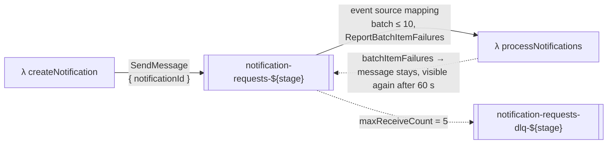
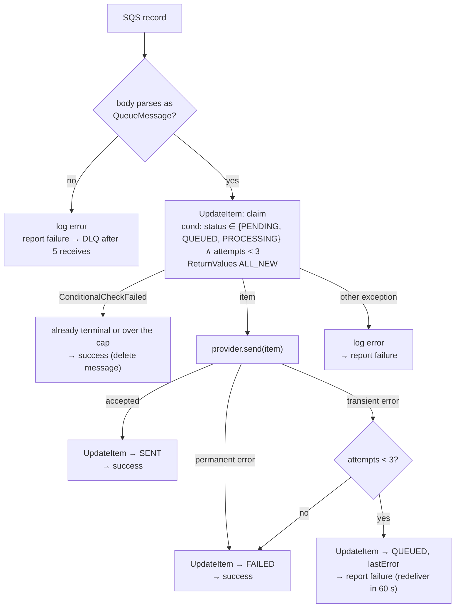

# SQS message design — `notification-requests`

The queue decouples _accepting_ a request from _processing_ it. It carries pointers, not payloads: DynamoDB
is the source of truth, and the message only says "go look at this request".

## Message

### Body

```json
{ "notificationId": "3f0c9a52-8f6e-4d63-9a51-3c1e0f2b7d10" }
```

That is the entire message. Validated on both ends with one schema (`backend/src/queue/message.ts`):

```ts
export const queueMessageSchema = z.strictObject({
  notificationId: z.uuid(),
});
export type QueueMessage = z.infer<typeof queueMessageSchema>;
```

The producer serialises `QueueMessage` with `JSON.stringify`; the worker parses each record's `body` with
`queueMessageSchema.safeParse`. A body that fails to parse is a **poison message** (see below).

### Why a pointer and not the whole request

|                     | Pointer (`notificationId`)                                                                                                                                          | Full payload                                                       |
| ------------------- | ------------------------------------------------------------------------------------------------------------------------------------------------------------------- | ------------------------------------------------------------------ |
| Source of truth     | One: DynamoDB                                                                                                                                                       | Two; the copy in the queue can go stale                            |
| Worker's first step | Claim the item with `UpdateItem … ReturnValues: ALL_NEW` — one call both transitions the status **and** returns the current item, so there is no separate `GetItem` | Trust the payload, then still need DynamoDB for the status check   |
| Retry semantics     | Every attempt reads current state (`attempts`, `status`)                                                                                                            | Retries carry the original snapshot                                |
| Size                | ~60 bytes                                                                                                                                                           | Up to 5 KB of message text; well under SQS's 256 KB, but pointless |

The worker has to touch DynamoDB anyway to claim the request, so carrying the payload would buy nothing.

### No message attributes, no message group

Nothing routes on the message, and nothing needs ordering: each notification is independent. The queue is a
**Standard** queue (at-least-once, best-effort order), which is exactly the guarantee the design needs —
every downstream transition is idempotent, so a duplicate delivery is a no-op, not a bug.

## Queues



| Setting                  | Main queue                 | Dead-letter queue | Why                                                                                                                                                                        |
| ------------------------ | -------------------------- | ----------------- | -------------------------------------------------------------------------------------------------------------------------------------------------------------------------- |
| Type                     | Standard                   | Standard          | Ordering not needed; FIFO would cap throughput and add a group id for nothing.                                                                                             |
| `VisibilityTimeout`      | 60 s                       | —                 | Must exceed the worker's Lambda timeout (10 s) with margin — AWS recommends ≥ 6×. It is also the retry delay: a message the worker reports as failed reappears after 60 s. |
| `MessageRetentionPeriod` | 4 days (default)           | 14 days (max)     | The main queue drains in seconds; the DLQ holds evidence until someone looks.                                                                                              |
| `RedrivePolicy`          | `maxReceiveCount: 5` → DLQ | —                 | Safety net for messages that _crash_ the worker rather than fail cleanly (see two failure classes below).                                                                  |
| Encryption               | SQS-managed (SSE-SQS)      | same              | Free, no key to manage.                                                                                                                                                    |

### Two failure classes, two mechanisms

| Class                                                               | Example                                                      | Who counts                                                 | Limit                 | Ends in                                                        |
| ------------------------------------------------------------------- | ------------------------------------------------------------ | ---------------------------------------------------------- | --------------------- | -------------------------------------------------------------- |
| **Business failure** — the worker ran, the provider said no         | timeout, 5xx from provider                                   | `attempts` on the DynamoDB item, incremented on each claim | `MAX_ATTEMPTS = 3`    | `status = FAILED` with `lastError`; message deleted            |
| **Infrastructure failure** — the worker could not record an outcome | DynamoDB unreachable, a bug that throws, an unparseable body | SQS `ApproximateReceiveCount`                              | `maxReceiveCount = 5` | Message moved to the DLQ; item stays in whatever status it had |

Keeping them separate means a flaky provider never fills the DLQ, and a crashing worker never burns the
request's three attempts.

## Event source mapping (worker trigger)

```yaml
functions:
  processNotifications:
    handler: src/handlers/queue/processNotifications.handler
    timeout: 10
    events:
      - sqs:
          arn: !GetAtt NotificationRequestsQueue.Arn
          batchSize: 10
          maximumBatchingWindow: 0
          functionResponseType: ReportBatchItemFailures
```

- **`batchSize: 10`** — Lambda invokes with up to 10 records; the worker processes them sequentially (each
  is a couple of fast DynamoDB calls plus one provider call).
- **`maximumBatchingWindow: 0`** — invoke as soon as a message exists; latency matters more than batch
  efficiency at this scale.
- **`functionResponseType: ReportBatchItemFailures`** — the worker returns which records failed. SQS deletes
  the rest and redelivers only those. Without this, one failure would redeliver the whole batch, re-running
  successful items (harmless thanks to the conditional updates, but wasteful and confusing in the logs).

## How the worker handles one record



Outcome → `batchItemFailures`:

| Outcome                                | Message            | Reasoning                                                                                                                                            |
| -------------------------------------- | ------------------ | ---------------------------------------------------------------------------------------------------------------------------------------------------- |
| `SENT`                                 | delete (success)   | Done.                                                                                                                                                |
| `FAILED` (permanent, or 3rd transient) | delete (success)   | The DB records the failure; redelivery could not change it.                                                                                          |
| Transient error, attempts left         | **report failure** | SQS redelivers after the visibility timeout — this _is_ the retry.                                                                                   |
| Claim condition failed                 | delete (success)   | Duplicate delivery, or a request already terminal. Nothing to do.                                                                                    |
| Unparseable body                       | **report failure** | Retrying will not fix it, but reporting failure routes it to the DLQ (after 5 receives) where a human can see it. Deleting would erase the evidence. |
| Unexpected exception (DynamoDB / SDK)  | **report failure** | Transient infrastructure problem; the receive count, not `attempts`, is the limit.                                                                   |

The handler returns `{ batchItemFailures: [{ itemIdentifier: record.messageId }, …] }`. An **empty** array
deletes the whole batch; **throwing** from the handler fails the whole batch — the worker never throws.

## Idempotency

Two layers make at-least-once delivery safe:

1. **The claim condition** — a redelivered message for a `SENT` or `FAILED` item fails
   `ConditionalCheckFailedException` and is skipped.
2. **The idempotency key to the provider** — `provider.send()` receives the request id, so a real provider
   that supports idempotency keys (SES v2 does not; many transactional APIs do) would not double-send even if
   the worker crashed _after_ the provider accepted but _before_ writing `SENT`. With the simulated provider
   this is only a contract; it is the seam a real integration would fill.

The one window not closed: the crash-after-send-before-`SENT` case with a provider that has no idempotency
support could deliver twice. That is the classic exactly-once gap; a real deployment would rely on the
provider's key or accept the rare duplicate.

## Producer (API side)

`backend/src/queue/producer.ts` wraps `SendMessageCommand`:

```ts
await sqs.send(
  new SendMessageCommand({
    QueueUrl: config.queueUrl,
    MessageBody: JSON.stringify({ notificationId } satisfies QueueMessage),
  }),
);
```

Called by `createNotificationService` **after** the `PENDING` `PutItem` and **before** the `QUEUED`
`UpdateItem`. If `send` throws, the service marks the item `FAILED` (`enqueueFailed`) and the API returns
`503 ENQUEUE_FAILED`. See the README trade-offs for the crash-between-writes window.

## CloudFormation (in `backend/serverless.yml`)

```yaml
resources:
  Resources:
    NotificationRequestsDLQ:
      Type: AWS::SQS::Queue
      Properties:
        QueueName: notification-requests-dlq-${sls:stage}
        MessageRetentionPeriod: 1209600 # 14 days
        SqsManagedSseEnabled: true

    NotificationRequestsQueue:
      Type: AWS::SQS::Queue
      Properties:
        QueueName: notification-requests-${sls:stage}
        VisibilityTimeout: 60
        SqsManagedSseEnabled: true
        RedrivePolicy:
          deadLetterTargetArn: !GetAtt NotificationRequestsDLQ.Arn
          maxReceiveCount: 5

  Outputs:
    QueueUrl: { Value: !Ref NotificationRequestsQueue }
```

Per-function IAM:

| Function               | Actions                                                             | Resource                                                             |
| ---------------------- | ------------------------------------------------------------------- | -------------------------------------------------------------------- |
| `createNotification`   | `sqs:SendMessage`                                                   | main queue                                                           |
| `processNotifications` | `sqs:ReceiveMessage`, `sqs:DeleteMessage`, `sqs:GetQueueAttributes` | main queue (the event source mapping polls with the function's role) |

Nobody gets DLQ permissions; redrive is done from the console or CLI when needed.

## Local development

ElasticMQ (`backend/local/elasticmq.conf`) declares both queues with the same names, visibility timeout, and
redrive policy. The local runner's poller (`backend/local/server.ts`) mirrors the event source mapping: long-poll
`ReceiveMessage` (`MaxNumberOfMessages: 10`, `WaitTimeSeconds: 20`), build a real `SQSEvent`, invoke the
handler, then `DeleteMessageBatch` for every record **not** listed in `batchItemFailures`. The handler code
is identical to production; only the poller is local.

## Alternatives considered

| Alternative                                       | Why not                                                                                                                                  |
| ------------------------------------------------- | ---------------------------------------------------------------------------------------------------------------------------------------- |
| FIFO queue                                        | Ordering and exactly-once are not needed; costs throughput (300 msg/s per group) and requires deduplication ids.                         |
| Full request in the message                       | Second copy of the data; the worker must read DynamoDB anyway to claim the item.                                                         |
| `DelaySeconds` for exponential backoff            | Would need the worker to re-send the message with a delay instead of reporting failure; more code paths. Listed as a future improvement. |
| Step Functions for retries                        | A state machine per request for a three-attempt policy is more infrastructure than the problem warrants.                                 |
| EventBridge / SNS in front of SQS                 | Useful for fan-out to multiple consumers; there is one consumer.                                                                         |
| Lambda destinations / async invoke instead of SQS | No visibility timeout control, no partial batch failure, no DLQ inspection of the original message. The task also names SQS explicitly.  |
